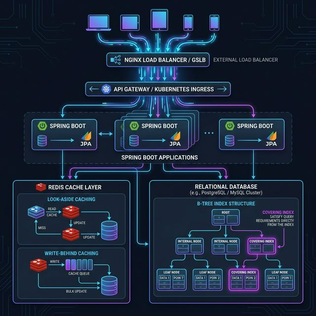

# 🏭 대규모 트래픽 처리 및 검색 아키텍처 (Large Traffic & Search Architecture)

> **"JPA에서 시작하여 인덱스를 거쳐 레디스라는 종착역까지, 데이터의 흐름을 지배하라."**

---

## 🖼️ 사고의 시각화 (Military Analogy Diagram)

> [!TIP]
> **아키텍처 조감도 분석**:
>
> 1. 유저 트래픽이 Spring Boot(JPA)로 유입됩니다.
> 2. **DB 계층**: 클러스터링 인덱스 기반의 Random I/O 병목을 커버링 인덱스로 방어하여 메모리 수준의 탐색 속도를 확보합니다.
> 3. **Redis 계층**: 물리적인 DB 커넥션 고갈을 막기 위해 Look Aside 캐싱을 수행하고, 쓰기 병목(Update)은 Write Behind 패턴으로 지연 처리하여 DB 부하를 극한으로 낮춥니다.

---

## 🛠️ 사고의 설계도 (Active Tracing)

### 1단계: JPA의 한계 (문제의 정의)

- **구조적 본질:** JPA는 기본적으로 `Map<PK, Entity>` 형태의 클러스터링 인덱스에 의존한다.
- **병목 점프:** 단순 CRUD는 빠르지만, 트래픽이 몰리는 순간 **물리적 디스크 탐색(Random I/O)**이 발생하며 시스템 전체가 느려진다.
- **통찰:** "데이터베이스의 가장 무거운 비용은 네트워크도, CPU도 아닌 **디스크 헤드의 움직임(Disk I/O)**이다."

### 2단계: 인덱스의 진화 (Scenario A: 다중 검색 최적화)

- **일반 인덱스의 배신:** `Index 노드 탐색 -> PK 획득 -> 디스크 본문 탐색`. 이 과정에서 발생하는 추가적인 디스크 접근이 대규모 트래픽에서는 독이 된다.
- **커버링 인덱스의 위력 (Zero I/O):**
  - `WHERE`, `ORDER BY`, `SELECT`에 필요한 모든 정보를 인덱스 트리에 미리 태워둔다.
  - 데이터베이스가 "디스크를 열어볼 필요가 없다"고 판단하는 순간, 쿼리는 메모리 연산 수준의 성능을 낸다.

### 3단계: Redis의 구원 (Scenario B: 커넥션 & 동시성 제어)

- **커넥션 고갈:** 인덱스로 쿼리가 빨라져도, 접속자 자체가 수만 명이면 DB와 연결할 '파이프(Connection)' 자체가 부족해진다.
- **Read 방어 (Look Aside):** 무거운 집계 쿼리는 Redis에 JSON으로 박아둔다. 1만 명이 와도 DB는 잠을 잔다.
- **Write 방어 (Write Behind):** 조회수+1 같은 사소한 작업으로 DB Row Lock을 걸지 않는다. Redis 싱글 스레드에서 `INCR`로 초고속 처리 후, 10분마다 모아서 DB에 한 방을 날린다 (**Batch Update**).

---

## 🎙️ 3단계: 실전 발화 (Verbatim Execution)

### [Case 1] 커버링 인덱스를 활용한 검색 최적화 경험에 대해 설명해주세요.

> **주군:** (발화 대기 중...)

### [Case 2] 왜 대규모 트래킹 처리에서 Redis를 'Write Behind' 패턴으로 사용하나요?

> **주군:** (발화 대기 중...)

---

## ⚔️ 부관의 전술적 피드백 (Senior Engineering Mentor)

1.  **Trade-off의 이해:** 커버링 인덱스는 읽기 성능을 극한으로 끌어올리지만, **쓰기(Insert/Update) 성능과 인덱스 크기**라는 비용을 지불합니다. 면접에서는 이 "비용"을 알고 있음을 꼭 언급해야 합니다.
2.  **데이터 일관성 (Consistency):** Write Behind 패턴은 Redis가 죽었을 때 **최근 10분간의 데이터 소실** 가능성이 있습니다. "로그성 데이터(조회수 등)에는 적합하지만, 결제 등 중요 데이터에는 위험하다"는 통찰을 덧붙이면 시니어급 평가를 받습니다.
3.  **sbb_board 적용 제안:** 현재 sbb_board의 복합 검색 기능에 `EXPLAIN`을 돌려보고, 커버링 인덱스 적용 전후의 `rows` 탐색 수 차이를 직접 확인해 보는 것이 다음 퀘스트의 핵심입니다.
