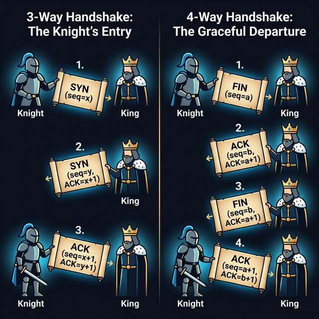
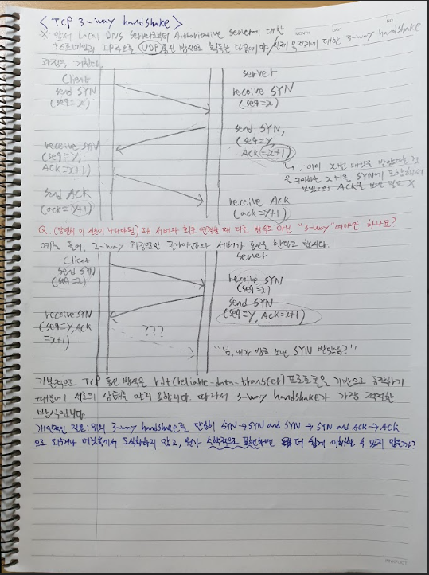
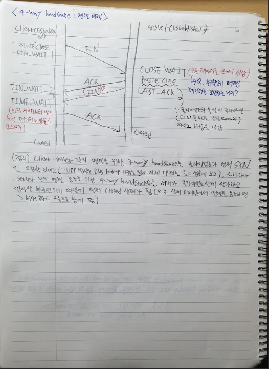
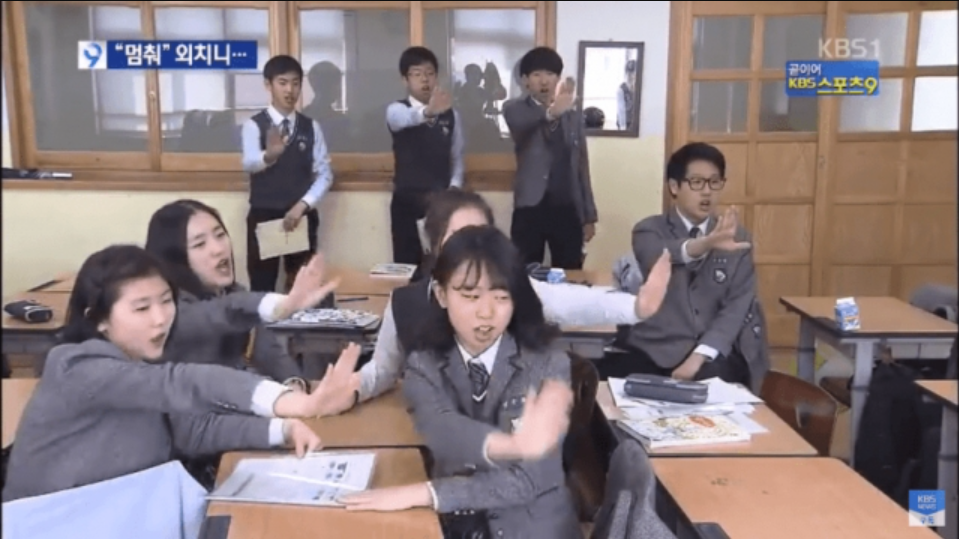

# 🧠 사고의 단련장 (Thought Workshop) - TCP Handshake

## 📈 사고 진화 기록 (Evolution Log)

### 퀘스트 02: TCP 3-Way & 4-Way Handshake - "신뢰의 다리 놓기"

#### 🛡️ 1단계: 초기 인식 (Intuition)

- "데이터를 보내기 전에 서로 마음이 맞는지 확인하는 '예절' (3-Way)."
- "헤어질 때도 뒷정리를 깔끔하게 하는 '품격' (4-Way)."
- "왜 바로 안 보내고 복잡하게 구나? -> '신뢰'가 생명인 TCP니까."

#### 🏗️ 2단계: 논리 조립 (Architecture)

- **3-Way (연결):**
  - `SYN` ➡️ `SYN/ACK` ➡️ `ACK` 의 3단계.
  - 양방향 송수신 가능 여부를 최종 확인하는 '결혼식' 같은 절차.
- **4-Way (종료):**
  - `FIN` ➡️ `ACK` ➡️ `FIN` ➡️ `ACK` 의 4단계.
  - 한쪽이 끝났다고 해도 반대쪽의 데이터가 남았을 수 있음을 배려하는 '매너'.
  - **TIME_WAIT:** 마지막 보낸 ACK가 유실될 경우를 대비한 '자비로운 기다림'.

#### 🎙️ 3단계: 실전 발화 (Verbatim Execution)

- "TCP 연결은 클라이언트와 서버 간의 신뢰가 있는 프로토콜 연결을 지향하기 때문에 TCP 연결을 씁니다. 먼저 시간의 순서의 흐름에 따라 패킷의 전달 및 받음은 다음과 같습니다. 클라이언트가 먼저 서버한테 SYN 플래그가 있는 패킷을 전달합니다. 거기에 그 패킷은 세그먼트죠. TCP는 세그먼트가 하나의 단위이기 때문에 그 세그먼트에 있는 시퀀스 X라고 가정해 봅시다. SYN 플래그를 서버한테 전달해 줍니다. 그럼 서버는 그 패킷을 받고 받았다는 것을 클라이언트한테 알리기 위해 X+1 시퀀트 번호가 있는 ACK의 그 플래그와 서버도 클라이언트한테 SYN 플래그를 보내기 위해 시퀀스 Y라는 고유적인 번호를 붙여서 다시 클라이언트한테 전달합니다. 만약에 여기서 2-way만 된다면 클라이언트는 이 SYN 패킷과 ACK 패킷을 받았는데 서로 간의 상태는 모르기 때문에... 서버는 클라이언트가 제대로 패킷을 받았는지 알 방도가 없습니다. 올드 듀플리케이트 패킷이 오면 서버는 수동적으로 다시 연결을 하므로 시스템적으로 혼란을 줍니다. 그래서 이를 해결하기 위해 다시 클라이언트는 서버로부터 받은 패킷을 제대로 받았다고 서버한테 알리기 위해 ACK 플래그 패킷에 Y+1이라는 시퀀스 번호를 서버한테 전달해 줍니다."

#### ⚡ 4단계: 사고의 균열 & 교정 (Reflection)

- **균열:** 2-way 상황에서 '네트워크 오버헤드'를 혼란의 주원인으로 꼽았으나, 실제로는 서버가 불필요하게 ESTABLISHED 상태로 진입하여 자원을 낭비하는 'Half-open' 문제가 더 치명적임.
- **교정 (S-Rank Answer):**
  - **양비론(Bidirectional Confidence):** A는 B가 들리는지(SYN) 물어보고, B는 A가 들리는지(SYN/ACK) 되물어야 합니다. 마지막으로 A가 "어, 나도 네 말 들려!(ACK)"라고 답해야만 **양쪽 모두 '보내고 받기'가 가능하다는 확신**을 가질 수 있습니다.
  - **망령 패킷(Old Duplicate SYN) 방어 & Half-open 차단:** 서버는 `SYN/ACK` 전송 후 `SYN_RCVD` 상태에서 대기하며, 클라이언트의 최종 `ACK`를 받아야만 성문을 엽니다. 만약 '망령'이 나타나도 클라이언트는 이를 거부(RST)하거나 무시함으로써 서버의 자원 오남용을 원천 차단합니다.
  - **시퀀스 번호의 동기화 (ISN Consensus):** 3-way는 단순히 연결을 맺는 것을 넘어, 양측의 **초기 시퀀스 번호(Initial Sequence Number)**에 대해 합의(Consensus)하는 과정입니다.

---

### [2026-03-10] TCP Handshake: 용사와 왕의 서사 (Fairy Tale Analogy)

#### 🏗️ 2단계: 논리 조립 (Architecture - User Analogy)

- **3-way handshake (왕국 입성):**
  - **Step 1 (SYN):** 용사가 성문 앞에서 "왕께 칙령(X번)을 전하러 왔다!"고 외침.
  - **Step 2 (SYN-ACK):** 왕이 "X번 칙령 확인(X+1). 어서 오라. 내 어명(Y번)도 받으라."며 답함.
  - **Step 3 (ACK):** 용사가 "어명 확인(Y+1). 지금 들어간다!"며 입성.
- **4-way handshake (우아한 작별):**
  - **Step 1 (FIN):** 용사가 "이제 볼일 다 봤으니 떠나겠소."라고 알림.
  - **Step 2 (ACK):** 왕이 "알겠소. 하지만 두고 간 짐(남은 데이터)이 있으니 챙겨주겠소." (`CLOSE_WAIT`)
  - **Step 3 (FIN):** 왕이 모든 짐을 실어 보내며 "이제 정말 끝이오. 잘 가시오."라고 최종 작별.
  - **Step 4 (ACK):** 용사가 "짐 다 받았소. 진짜 가오!"라고 답하고 잠시 기다린 뒤 (`TIME_WAIT`) 퇴장.

#### 🖼️ 사고의 시각화

#### 🧩 파란 펜의 해답 (Blue Pen Clearance - TCP 4-Way)

- **Q: "누구한테 어떤 데이터를 보낼 수 있는 거지?" (CLOSE_WAIT 상태)**
  - **A:** 서버(왕)가 클라이언트(용사)에게 보냅니다. 용사가 종료를 선언(FIN)했더라도, 서버 측에서 아직 전송이 완료되지 않은 **'잔여 데이터'**를 모두 털어내기 위해 존재하는 구간입니다.

- **Q: "TIME_WAIT 없이 즉시 새 연결을 맺으면 왜 오염(Contamination)이 발생하는가?"**
  - **A:** 이전 세션에서 길을 잃고 떠돌던 **'지연된 데이터 패킷'**이 우연히 현재 세션의 시퀀스 번호 범위 내에서 서버에 도착할 수 있습니다. `TIME_WAIT`은 모든 지연 패킷이 소멸(MSL 만료)될 때까지 기다리는 **'세션 간 자가격리 기간'**입니다.

##### 🛑 "망령 패킷 멈춰!" (TIME_WAIT Analogy)

---

### 🏆 사고의 진화 (Evolution)

- **[2026-03-11]**: "TCP는 **두 개의 단방향 신뢰 통로가 하나로 묶인 전이중(Full-Duplex) 성벽**이다. 송신자가 패복(Packet Loss)을 책임지는 '단방향적 책임감(Sender Responsibility)'과, 네트워크 전체를 무방향 그래프로 연결해 기동성을 확보한 '양방향적 포워딩(Network Forwarding)'이 조화를 이뤄 현대 인터넷의 대동맥을 완성한다." (S-Rank 달성)
