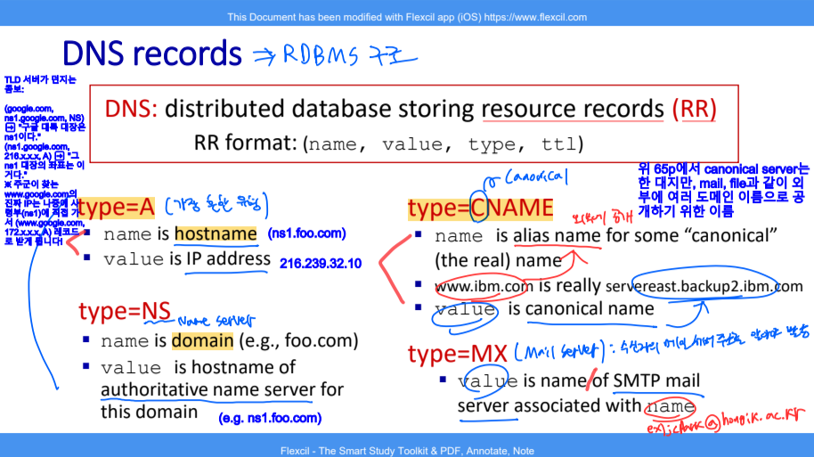

# 🧠 사고의 단련장 (Thought Workshop) - DNS (Domain Name System)

## 📈 사고 진화 기록 (Evolution Log)

### 퀘스트 03: DNS (Domain Name System) - "IP 찾기 원정대"

#### 🛡️ 1단계: 초기 인식 (Intuition)

- "숫자는 외우기 싫으니까 이름으로 부르자."
- "이름을 치면 어딘가에서 IP를 툭 던져주는 마법의 상자."

#### 🏗️ 2단계: 논리 조립 (Architecture)

- **왜 한 명한테 안 맡기나? (Centralized issues):**
  - **SPOF (Single Point of Failure):** 걔가 죽으면 지구가 멈춤.
  - **Traffic Volume:** 전 세계 사람이 한 명한테만 물어보면 멘탈 나감.
  - **Distant Central Database:** 한국에서 미국 서버에 물어보면 왕복 시간이 너무 김 (Latency).
  - **Maintenance:** 매일 생겨나는 수억 개의 도메인을 혼자 다 적어넣는 건 불가능.
- **분산의 해법 (Hierarchy):**
  - `Root Server` ➡️ `TLD Server (.com, .org)` ➡️ `Authoritative Server (google.com)` 순으로 권한을 위임하여 관리.

#### 🎙️ 3단계: 실전 발화 (Verbatim Execution)

- "네, 먼저 DNS 서버를 중앙집중형이 아닌 계층적 분산 구조로 설계한 이유는 여러 가지 장점이 있기 때문입니다. 먼저 첫 번째 분산... 계층적 분산 구조, 그러니까 하이러키 구조죠. 그걸로 하면 먼저 SPOF, 단일 지점의 실패를 막을 수 있습니다. 서버가 다운되거나 불타버리면 모든 데이터가 소실되고 심지어 네트워크도 다운이 됩니다. 그리고 두 번째로는 트래픽이 몰리는 것을 막을 수 있습니다. 인터넷은 보통 네트워크 오브 네트워크로서 유저들이 동시에 다발적으로 합니다. 계층형 분산 구조로 되어 있으면 유저가 쿼리를 날리는 리소스들을 기록하기가 쉽습니다."

#### ⚡ 4단계: 사고의 균열 & 교정 (Reflection)

- **균열:** 트래픽이 몰리는 상황에서 '레코드 테이블에 기록하기 힘들다'는 표현은 서버의 처리 능력보다는 대역폭 포화와 중앙 서버의 부하 집중 관점으로 설명하는 것이 더 명확함.
- **교정:** 물리적 거리(Latency)와 관리의 확장성(Scalability) 관점을 추가하여 4대 공학적 가치(안정성, 부하분산, 속도, 확장성)를 완성함.
- **균열:** 브라우저가 바로 Root 서버로 달려간다고 생각함. (대리인의 부재)
- **교정:** 우리 집 근처(ISP)에 상주하는 **'Local DNS'**라는 성실한 대리인이 대신 발품을 팔아준다는 사실을 추가.

#### 💎 5단계: 진화된 사고 (Evolution)

- DNS는 단순한 '전화번호부'가 아니라, 전 세계의 트래픽을 효율적으로 처리하기 위해 **거대한 계층 구조로 설계된 분산형 데이터베이스 시스템**이다. 특히 **Iterative Query**와 **Caching**의 조화는 상위 계층 서버의 부하를 최소화하면서도 빠른 응답을 가능케 하는 분산 시스템의 정수다.

---

### 퀘스트 04: DNS의 심화 메커니즘 - "질의 방식과 레코드의 철학"

#### 🛡️ 1단계: 초기 인식 (Intuition)

- "물어보는 방법에도 여러 가지가 있다? 재귀(Recursive)는 내가 다 해주는 것, 반복(Iterative)은 알려만 주는 것."
- "레코드는 전화번호부의 한 줄 한 줄을 구성하는 데이터 양식."

#### 🏗️ 2단계: 논리 조립 (Architecture)

- **질의 방식의 차이 (Iterative vs Recursive):**
  - **Recursive:** Root 서버가 최종 IP까지 직접 알아다 줌 ($O(N)$의 깊이만큼 상위 서버에 부하 집중 ➡️ 거의 사용 안 함).
  - **Iterative:** Root는 다음 갈 곳(TLD)만 알려주고, 발품은 Local DNS가 파는 구조 (상위 서버의 부하 분산 ➡️ 인터넷의 표준).
  - **Bridge:** 이 구조는 하드웨어의 **Memory Hierarchy (L1, L2 Cache)** 및 **JPA의 1차 캐시** 철학(가까운 곳에서 해결, 멀리 가기 최소화)과 맞닿아 있음.
- **레코드 타입의 전술:**
  - **Type A:** 호스트네임 ➡️ IP 주소 매핑 (실제 좌표).
  - **Type NS:** 도메인 ➡️ Authoritative 네임 서버 명칭 (사령부 안내).
  - **Type CNAME:** 별명 ➡️ 진짜 이름 (관리의 용이성).
  - **Type MX:** 메일 서버 정보 (특수 목적 트래픽 관리).

##### 🛠️ Deep-Dive: DNS 리소스 레코드(RR)의 구조 (Name vs Value)

> **"레코드의 Name과 Value가 정확히 무엇을 의미하나요?"** 에 대한 시니어의 답변

DNS는 단순한 텍스트 파일이 아니라, **`RR format: (Name, Value, Type, TTL)`** 이라는 정교한 RDBMS 구조를 가진 분산 데이터베이스입니다. `Type`에 따라 `Name`과 `Value`의 정의가 달라집니다.

1.  **Type A (Address):** 가장 흔한 유형
    - **Name:** 호스트네임 (예: `ns1.foo.com`)
    - **Value:** 해당 호스트의 **IP 주소** (예: `216.239.32.10`)
2.  **Type NS (Name Server):** 권한의 위임
    - **Name:** 도메인 명칭 (예: `foo.com`)
    - **Value:** 해당 도메인의 정보를 알고 있는 **권위 있는 네임 서버의 호스트네임** (예: `ns1.foo.com`)
3.  **Type CNAME (Canonical Name):** 별칭 관리
    - **Name:** 별칭(Alias) 이름 (예: `www.ibm.com`)
    - **Value:** 실제(Real) 정식 이름, 즉 **Canonical Name** (예: `servereast.backup2.ibm.com`)
4.  **Type MX (Mail Exchange):** 메일 전용
    - **Name:** 메일 수신 도메인 이름 (예: `hongik.ac.kr`)
    - **Value:** 해당 메일을 처리할 **메일 서버의 호스트네임**

##### 🖼️ 사고의 시각화 (DNS Record Structure)

> **Insight:** TLD 서버가 돌려주는 **Glue Record**는 사실 `Type NS`와 `Type A`의 조합입니다. "foo.com의 네임서버는 ns1.foo.com이야(NS)"라고 알려주면서, 동시에 "근데 ns1.foo.com의 IP는 216.239.32.10이야(A)"라고 **Value**를 함께 던져줌으로써 순환 참조를 끊고 즉시 접속하게 만드는 고도의 전술입니다.

- **DNS Registrar (등록):** 새로운 도메인 등록 시 TLD에 **NS 레코드**와 **A 레코드(Glue Record)**를 쌍으로 넣어 순환 참조(Circular Reference)를 방지함.

#### 🎙️ 3단계: 실전 발화 (Verbatim Execution)

- "유저가 쿼리를 날리면 브라우저에 있는 로컬 DNS 서버는 보통 TLD 서버에 기록이 캐싱으로 기록이 되어 있습니다. 바로 TLD DNS 서버로 가면 이 굴루 레코드라고 네임 서버와 그러니까 이 네임으로는 호스트 네임으로는 도메인 이름이 있고 밸류로는 네임 서버가 있고요. 그다음에는 A 레코드를 주는데 A 레코드의 호스트 네임은 방금 네임 서버의 밸류로 받은 네임 서버 호스트 네임과 밸류는 그 네임 서버의 실제 IP 주소를 건네줍니다. 로컬 DNS 서버는 그렇기 때문에 정확하게 권위 있는 DNS 서버로 찾아갈 수가 있습니다. 만약에 굴루 레코드에서 하나의 레코드라도 빠지면 정확히 권위 있는 DNS 서버로 찾아가기가 힘들기 때문에 TLD 서버는 굴루 레코드를 마련함으로써 최적의 경로를 갈 수 있게 만들어줍니다."

#### ⚡ 4단계: 사고의 균열 & 교정 (Reflection)

- **균열:** TLD 서버가 최종 IP를 안다고 착각함.
- **교정:** TLD는 최종 목적지가 아닌 **'다음 사령부(Authoritative)의 이름(NS)과 주소(A)'**를 알려주는 표지판 역할을 수행함을 명시 (Glue Record).

#### 💎 5단계: 진화된 사고 (Evolution)

- **[2026-03-08]**: "DNS는 단순한 전송을 넘어, **'권한의 위임(Delegation)'**과 **'부하의 분산'**을 통해 수십억 개의 엔티티를 관리하는 장엄한 공학적 설계물이다."

#### 🖼️ 사고의 시각화 (Military Analogy Diagram)

---

### 🏆 사고의 임계점 (Thresholds)

- **[2026-03-08]**: "DNS는 IP를 찾는 '정찰병'이고, TCP Handshake는 본대가 진격할 '보급로'를 확보하는 작업이다." (용사의 직관과 부관의 교정 합치)
