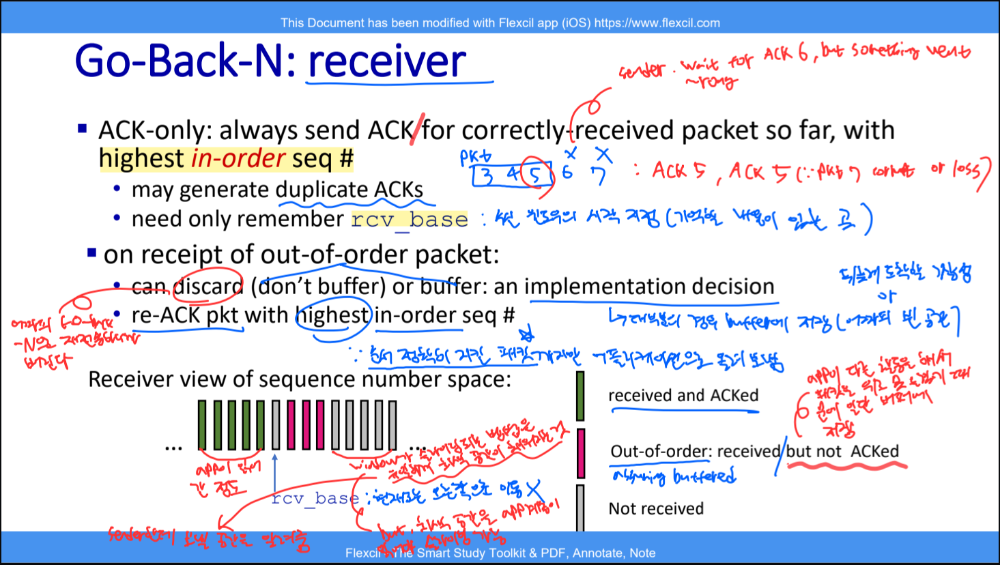
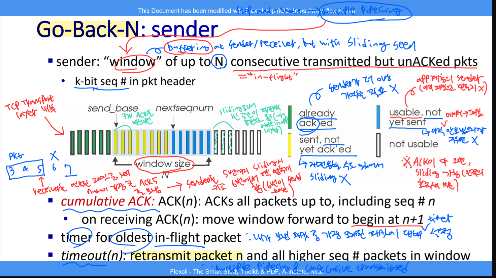
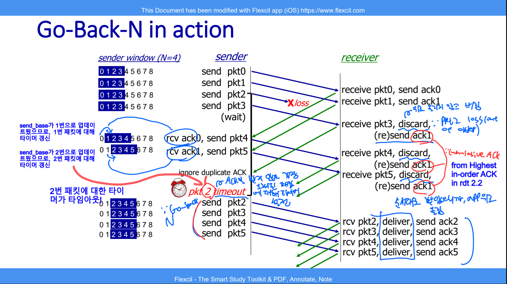

# 🧠 사고의 단련장 (Thought Workshop) - rdt & Pipelined Protocols

## 📈 사고 진화 기록 (Evolution Log)

### 퀘스트 05: rdt & Pipelined Protocols - "Reliability의 정수"

#### 🛡️ 1단계: 초기 인식 (Intuition)

- "네트워크는 전쟁터다. 패킷은 깨지고, 사라지고, 순서가 엉망이 된다."
- "이 개판(?) 속에서 TCP는 어떻게 '완벽한 신뢰'를 구축하는가?"
- "Stop-and-Wait는 너무 느리다. 한 번에 여러 발을 쏘되(Pipelining), 빗나간 탄환(Packet Loss)을 어떻게 찾아낼 것인가?"

---

#### 🏗️ [Stage 1]: 기초 신뢰성 수립 (rdt 1.0 ~ 2.2)

##### 💎 사고의 진화 (Evolution)

- **[rdt 1.0 & 2.0]**: "상대방의 피드백(ACK/NAK)은 기적처럼 절대 깨지지 않을 거라고 믿는 멍청한 설계(2.0)를 목격함."
- **[rdt 2.1]**: "모든 피드백마저 의심하라. Checksum을 ACK/NAK에도 넣고, 중복 패킷을 구분하기 위해 '0과 1'이라는 최소한의 번호표(Sequence Number)를 붙이는 것이 전송층 논리의 시작임을 깨달음."
- **[rdt 2.2 - NAK-free]**: "Receiver는 이제 NAK을 쓰지 않는다. 대신 '마지막으로 잘 받은 번호'를 반복(ACK numbering)함으로써 송신자에게 간접적으로 오류를 알리는 **'비대칭적 추론'**의 미학을 배움."

##### 🖼️ 사고의 시각화

---

#### 🏗️ [Stage 2]: 분실과의 전쟁 (rdt 3.0)

##### ⚡ 사고의 균열 & 교정 (Reflection)

- **균열:** "ACK가 깨지면 바로 재송신해야 효율적이지 않나?"
- **교정:** "아니다. 타이머가 돌고 있다면 잘못된 응답은 무시하고 끝까지 기다리는 것이 중복 전송 폭발을 막는 더 견고한(Robust) 설계다. 시간이라는 자원을 관리하는 것이 핵심이다."

##### 💎 사고의 진화 (Evolution)

- **[rdt 3.0]**: "신뢰성이란 '침묵(Loss)'에 대처하는 능력이다. 타이머는 네트워크의 불확실성을 '합리적 대기'로 치환하는 장치다. 다만, 한 번에 하나만 보내고 기다리는 **Stop-and-Wait** 구조는 물리적 한계가 명확함을 직시함."

##### 🖼️ 사고의 시각화

---

#### 🏗️ [Stage 3]: 성능의 한계와 돌파 ($U_{sender}$ & Pipelining)

##### 🛠️ $U_{sender}$ 수학적 격파 (Utilization Calculation)

- **상황 설정:** Speed 1Gbps, $d_{prop}$ 15ms, Packet $L$ 8000bits.
- **결론:** $U_{sender} \approx 0.00027$. 성벽을 쌓는 데 너무 집중한 나머지 물류 속도를 놓쳤다. 페라리를 사고 시속 1km로 달리는 꼴이다.

##### 🚀 기동전의 시작: Pipelined Protocols

- **해법:** "Timer(Reasonable wait time)는 건드리지 않는다. 대신 송신자 측에서 Utilization을 극대화하기 위해, ACK가 오기 전까지 송신자와 수신자 간의 **컨텍스트 윈도우(Context Window)** 극한까지 패킷을 최대한 많이 쏟아붓는다."

---

#### 🧬 [Genetic Link]: GBN은 조상들의 합작품

- **rdt 2.2 (Philosopher):** "NAK은 필요 없다. 마지막으로 성공한 번호(Cumulative ACK)만 외쳐라."
- **rdt 3.0 (Watchman):** "기다림에는 끝이 있어야 한다. 타이머를 돌려 분실을 확정하라."
- **GBN (General):** "조상들의 지혜를 묶어, 윈도우라는 군단을 파이프라인으로 진격시킨다. 단, 한 명이라도 낙오하면(Timeout) 전 군은 처음부터 다시 진격한다(Go-Back)."

---

#### 🏗️ [Stage 4]: 연대책임의 굴레, Go-Back-N (GBN)

##### 🎙️ 3단계: 실전 발화 (Verbatim Execution)

- "수신자가 out-of-order 패킷을 받았음에도 버리는 이유는 수신자의 컨텍스트 윈도우에서 rcv_base 인덱스에서 송신자로부터 받아야할 패킷 번호를 기억하고 있기 때문입니다. 그런데 구현 상황에 따라 버퍼에 저장할 수도 있고 안할 수도 있습니다. 전자가 해당하는 경우는 응용층에서 다른 활동을 해서 패킷을 미처받지 못하거나 이전의 rdt 3.0 FSM 다이아그램에서 재전송된 패킷을 받을 때 unreliable channel에서 전송층에 rdt_rcv(rcvpkt)을 호출을 해야하는 번거로움을 이미 저장한 버퍼에서 꺼내 쓰기만 하면 굳이 하위층의 함수를 호출하지 않고도 전송층에서 패킷을 알아서 처리하고 응용층에 올려보낼 수 있기 때문입니다."

##### ⚡ 4단계: 사고의 균열 & 교정 (Reflection)

- **균열:** "버퍼링을 하는 이유가 단순히 하위 계층 함수 호출의 번거로움을 피하기 위함인가?"
- **교정 (S-Rank Answer):**
  - **GBN의 필연적 선택 (Discarding):** GBN 수신자가 버리는 진짜 이유는 **'송신자의 약속(Protocol)'** 때문입니다. 송신자는 하나라도 ACK를 못 받으면 윈도우 전체를 다시 쏘기로(Go-Back-N) 약속했습니다. 따라서 수신자는 중간에 빠진 패킷 이후의 것들을 보관해 봐야, 어차피 송신자가 나중에 중복해서 쏠 것이기에 **'보관할 가치가 없다'**고 판단하는 것이 훨씬 경제적입니다.
  - **단순함의 미학:** 버리게 되면 수신자는 `expectedseqnum` 하나만 관리하면 됩니다.
  - **사용자 통찰 보완 (Buffering의 이유):** 주군께서 추측하신 '버퍼링 하는 경우'는 사실 **Selective Repeat (SR)**의 전술입니다. 버퍼링을 하면 송신자가 중복해서 쏘는 낭비를 막을 수 있지만, 그 대가로 수신자가 각 패킷의 순서를 맞추기 위해 버퍼를 관리해야 하는 **'지능형 수신자'**가 되어야 한다는 트레이드 오프가 있습니다.

##### 🖼️ 사고의 시각화

##### 💎 사고의 진화 (Evolution)

- **[2026-03-17]**: "GBN은 수신자의 버퍼 부하를 최소화하기 위해 **'순서가 맞지 않는 놈은 가차 없이 버린다'**는 극단적인 선택을 했다. 덕분에 수신자는 '다음에 올 번호' 하나만 기억하면 되는 단순함을 얻었지만, 송신자는 단 하나의 유실에도 윈도우 전체를 다시 쏴야 하는 **재전송 오버헤드**를 짊어지게 됨을 이해함."
- **[2026-03-17 - Senior Insight]**: "GBN의 'Go-Back'은 송신자의 시간과 대역폭을 과거로 돌리는 **비싼 결단**이고, SR의 'Individual ACK'는 수신자의 메모리와 연산력을 소모하는 **정밀한 관리**다."
- **[2026-03-18 - Timer Insight]**: "GBN의 타이머는 오직 '윈도우의 가장 앞단(Base)'만을 지킨다. 올바른 누적 ACK(Cumulative ACK)가 도착하여 윈도우가 전진(Sliding)하면, 이전 대장 패킷의 타이머는 멈추고 새로운 대장 패킷을 위해 타이머가 다시 시작된다. 이것이 단 1개의 타이머로 다수의 패킷 파이프라이닝을 통제하는 원리다."

##### 🚀 다음 전술: Selective Repeat (SR) - "정밀 타격의 시작"

- **핵심:** "왜 연대책임을 져야 하는가? 잘못된 놈만 다시 쏘면 안 되나?" ➡️ 이 질문이 SR의 탄생 배경임.
- **🚨 주의보:** SR에서는 윈도우 크기와 시퀀스 번호 범위 간의 상관관계($W \le \frac{1}{2} \times \text{SeqRange}$)가 매우 중요해진다.

---

## 🏆 오늘의 전승 요약 (Summary of Conquest)

- **수확:** rdt 1.0부터 3.0까지, 신뢰성을 위해 '번호표(Seq)', '신분증(Checksum)', '스톱워치(Timer)'를 하나씩 추가해가는 필연적 진화를 마스터함.
- **통찰:** rdt 3.0의 성능 한계($U_{sender}$)를 직시하고, 이를 타개하기 위한 **'윈도우 기반 파이프라이닝'**의 필연성을 공학적으로 도출함.
- **준비:** 이제 개별 패킷의 신뢰를 넘어, **'윈도우라는 성벽'** 안에서 시퀀스 번호와 버퍼를 어떻게 관리할 것인가(GBN/SR)를 격파할 준비가 됨.
