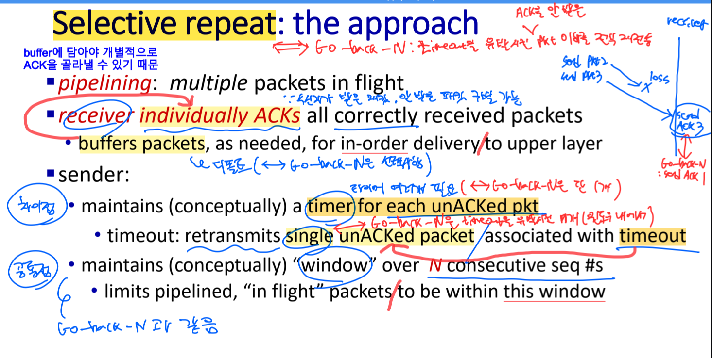
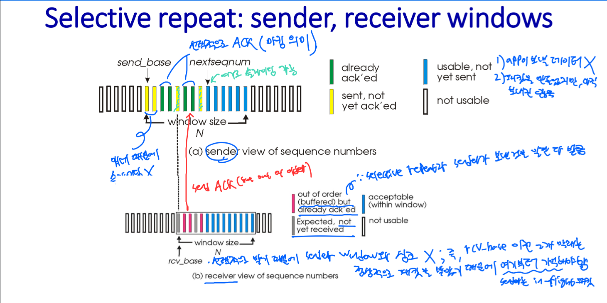
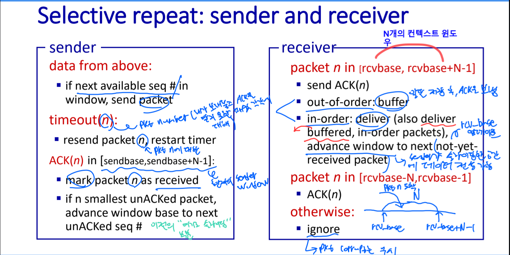
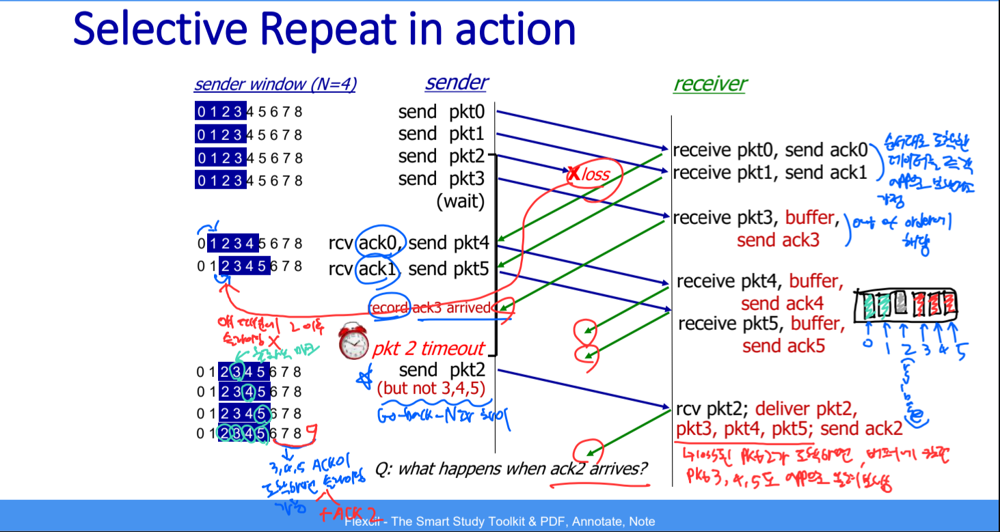
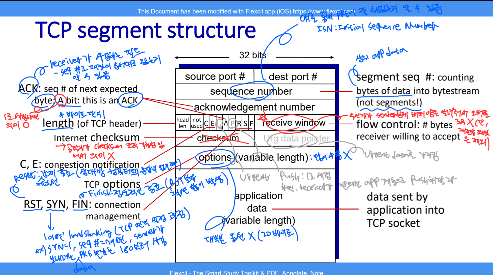
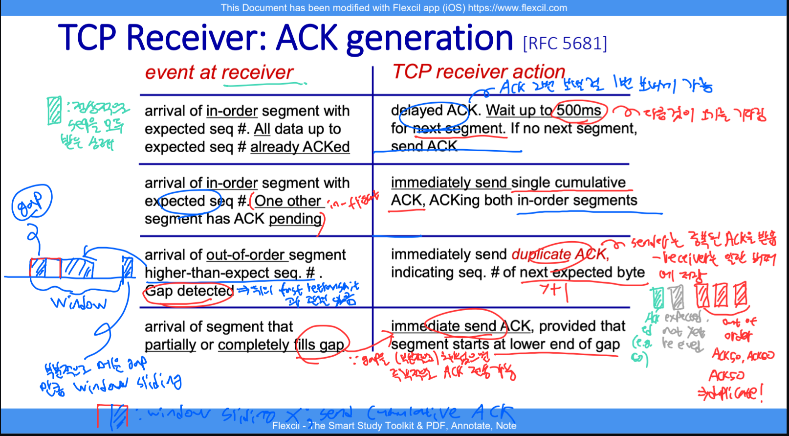
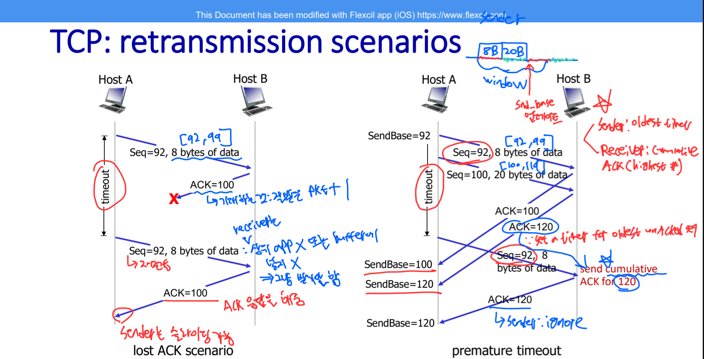

# 🧠 사고의 단련장 (Thought Workshop) - rdt & Pipelined Protocols

## 📈 사고 진화 기록 (Evolution Log)

### 퀘스트 05: rdt & Pipelined Protocols - "Reliability의 정수"

#### 🛡️ 1단계: 초기 인식 (Intuition)

- "네트워크는 전쟁터다. 패킷은 깨지고, 사라지고, 순서가 엉망이 된다."
- "이 개판(?) 속에서 TCP는 어떻게 '완벽한 신뢰'를 구축하는가?"
- "Stop-and-Wait는 너무 느리다. 한 번에 여러 발을 쏘되(Pipelining), 빗나간 탄환(Packet Loss)을 어떻게 찾아낼 것인가?"

---

#### 🏗️ [Stage 1]: 기초 신뢰성 수립 (rdt 1.0 ~ 2.2)

##### 💎 사고의 진화 (Evolution)

- **[rdt 1.0 & 2.0]**: "상대방의 피드백(ACK/NAK)은 기적처럼 절대 깨지지 않을 거라고 믿는 멍청한 설계(2.0)를 목격함."
- **[rdt 2.1]**: "모든 피드백마저 의심하라. Checksum을 ACK/NAK에도 넣고, 중복 패킷을 구분하기 위해 '0과 1'이라는 최소한의 번호표(Sequence Number)를 붙이는 것이 전송층 논리의 시작임을 깨달음."
- **[rdt 2.2 - NAK-free]**: "Receiver는 이제 NAK을 쓰지 않는다. 대신 '마지막으로 잘 받은 번호'를 반복(ACK numbering)함으로써 송신자에게 간접적으로 오류를 알리는 **'비대칭적 추론'**의 미학을 배움."

##### 🖼️ 사고의 시각화

---

#### 🏗️ [Stage 2]: 분실과의 전쟁 (rdt 3.0)

##### ⚡ 사고의 균열 & 교정 (Reflection)

- **균열:** "ACK가 깨지면 바로 재송신해야 효율적이지 않나?"
- **교정:** "아니다. 타이머가 돌고 있다면 잘못된 응답은 무시하고 끝까지 기다리는 것이 중복 전송 폭발을 막는 더 견고한(Robust) 설계다. 시간이라는 자원을 관리하는 것이 핵심이다."

##### 💎 사고의 진화 (Evolution)

- **[rdt 3.0]**: "신뢰성이란 '침묵(Loss)'에 대처하는 능력이다. 타이머는 네트워크의 불확실성을 '합리적 대기'로 치환하는 장치다. 다만, 한 번에 하나만 보내고 기다리는 **Stop-and-Wait** 구조는 물리적 한계가 명확함을 직시함."

##### 🖼️ 사고의 시각화

---

#### 🏗️ [Stage 3]: 성능의 한계와 돌파 ($U_{sender}$ & Pipelining)

##### 🛠️ $U_{sender}$ 수학적 격파 (Utilization Calculation)

- **상황 설정:** Speed 1Gbps, $d_{prop}$ 15ms, Packet $L$ 8000bits.
- **결론:** $U_{sender} \approx 0.00027$. 성벽을 쌓는 데 너무 집중한 나머지 물류 속도를 놓쳤다. 페라리를 사고 시속 1km로 달리는 꼴이다.

##### 🚀 기동전의 시작: Pipelined Protocols

- **해법:** "Timer(Reasonable wait time)는 건드리지 않는다. 대신 송신자 측에서 Utilization을 극대화하기 위해, ACK가 오기 전까지 송신자와 수신자 간의 **컨텍스트 윈도우(Context Window)** 극한까지 패킷을 최대한 많이 쏟아붓는다."

---

#### 🧬 [Genetic Link]: GBN은 조상들의 합작품

- **rdt 2.2 (Philosopher):** "NAK은 필요 없다. 마지막으로 성공한 번호(Cumulative ACK)만 외쳐라."
- **rdt 3.0 (Watchman):** "기다림에는 끝이 있어야 한다. 타이머를 돌려 분실을 확정하라."
- **GBN (General):** "조상들의 지혜를 묶어, 윈도우라는 군단을 파이프라인으로 진격시킨다. 단, 한 명이라도 낙오하면(Timeout) 전 군은 처음부터 다시 진격한다(Go-Back)."

---

#### 🏗️ [Stage 4]: 연대책임의 굴레, Go-Back-N (GBN)

##### 🎙️ 3단계: 실전 발화 (Verbatim Execution)

- "수신자가 out-of-order 패킷을 받았음에도 버리는 이유는 수신자의 컨텍스트 윈도우에서 rcv_base 인덱스에서 송신자로부터 받아야할 패킷 번호를 기억하고 있기 때문입니다. 그런데 구현 상황에 따라 버퍼에 저장할 수도 있고 안할 수도 있습니다. 전자가 해당하는 경우는 응용층에서 다른 활동을 해서 패킷을 미처받지 못하거나 이전의 rdt 3.0 FSM 다이아그램에서 재전송된 패킷을 받을 때 unreliable channel에서 전송층에 rdt_rcv(rcvpkt)을 호출을 해야하는 번거로움을 이미 저장한 버퍼에서 꺼내 쓰기만 하면 굳이 하위층의 함수를 호출하지 않고도 전송층에서 패킷을 알아서 처리하고 응용층에 올려보낼 수 있기 때문입니다."

##### ⚡ 4단계: 사고의 균열 & 교정 (Reflection)

- **균열:** "버퍼링을 하는 이유가 단순히 하위 계층 함수 호출의 번거로움을 피하기 위함인가?"
- **교정 (S-Rank Answer):**
  - **GBN의 필연적 선택 (Discarding):** GBN 수신자가 버리는 진짜 이유는 **'송신자의 약속(Protocol)'** 때문입니다. 송신자는 하나라도 ACK를 못 받으면 윈도우 전체를 다시 쏘기로(Go-Back-N) 약속했습니다. 따라서 수신자는 중간에 빠진 패킷 이후의 것들을 보관해 봐야, 어차피 송신자가 나중에 중복해서 쏠 것이기에 **'보관할 가치가 없다'**고 판단하는 것이 훨씬 경제적입니다.
  - **단순함의 미학:** 버리게 되면 수신자는 `expectedseqnum` 하나만 관리하면 됩니다.
  - **사용자 통찰 보완 (Buffering의 이유):** 주군께서 추측하신 '버퍼링 하는 경우'는 사실 **Selective Repeat (SR)**의 전술입니다. 버퍼링을 하면 송신자가 중복해서 쏘는 낭비를 막을 수 있지만, 그 대가로 수신자가 각 패킷의 순서를 맞추기 위해 버퍼를 관리해야 하는 **'지능형 수신자'**가 되어야 한다는 트레이드 오프가 있습니다.

##### 🖼️ 사고의 시각화

##### 💎 사고의 진화 (Evolution)

- **[2026-03-17]**: "GBN은 수신자의 버퍼 부하를 최소화하기 위해 **'순서가 맞지 않는 놈은 가차 없이 버린다'**는 극단적인 선택을 했다. 덕분에 수신자는 '다음에 올 번호' 하나만 기억하면 되는 단순함을 얻었지만, 송신자는 단 하나의 유실에도 윈도우 전체를 다시 쏴야 하는 **재전송 오버헤드**를 짊어지게 됨을 이해함."
- **[2026-03-17 - Senior Insight]**: "GBN의 'Go-Back'은 송신자의 시간과 대역폭을 과거로 돌리는 **비싼 결단**이고, SR의 'Individual ACK'는 수신자의 메모리와 연산력을 소모하는 **정밀한 관리**다."
- **[2026-03-18 - Timer Insight]**: "GBN의 타이머는 오직 '윈도우의 가장 앞단(Base)'만을 지킨다. 올바른 누적 ACK(Cumulative ACK)가 도착하여 윈도우가 전진(Sliding)하면, 이전 대장 패킷의 타이머는 멈추고 새로운 대장 패킷을 위해 타이머가 다시 시작된다. 이것이 단 1개의 타이머로 다수의 패킷 파이프라이닝을 통제하는 원리다."

##### 🚀 다음 전술: Selective Repeat (SR) - "정밀 타격의 시작"

- **핵심:** "왜 연대책임을 져야 하는가? 잘못된 놈만 다시 쏘면 안 되나?" ➡️ 이 질문이 SR의 탄생 배경임.
- **🚨 주의보:** SR에서는 윈도우 크기와 시퀀스 번호 범위 간의 상관관계( **W(윈도우 크기) ≤ Seq(시퀀스 번호) 범위 ÷ 2** )가 매우 중요해진다.

##### 🖼️ 진화된 사고의 시각화 (GBN vs SR)

##### ⚡ 5단계: 사고의 균열 & 교정 (GBN vs SR 윈도우 논리)

- **[2026-03-18 - Sliding Window Insight]**:
  - **GBN:** 송신자(Sender)만 슬라이딩 윈도우(크기 N)를 가진다. 수신자(Receiver)는 연대책임의 보석인 '단순함'을 택했기에 윈도우 크기가 사실상 1(`expectedseqnum`)이다. 따라서 슬라이딩의 주체는 오직 송신자뿐이다.
  - **SR:** 송신자와 수신자 **모두 슬라이딩 윈도우(크기 N)**를 가진다! 수신자는 도착하는 개별 패킷을 버퍼링하며 자신의 `rcv_base`를 관리(슬라이딩)하고, 송신자는 개별 ACK를 마킹하며 자신의 `send_base`를 관리(슬라이딩)한다.
  - **주의:** SR의 송신자도 당연히 윈도우를 슬라이딩시킨다. 단, 무조건 슬라이딩하는 것이 아니라 **"가장 앞단(send_base)의 패킷에 대한 ACK가 도착했을 때만"** 그 뒤로 이빨이 맞춰진(마킹된) 패킷들까지 한꺼번에 주르륵 윈도우를 전진시킨다.

##### 🍽️ 5.5단계: 직관적 비유 - 식당 대기표의 대참사 (The SR Dilemma)

- **상황 세팅 (W=3, SeqRange=4(0,1,2,3 번호 반복))**
  1. 지배인(Sender)이 0, 1, 2번 손님 부름 (윈도우 전송).
  2. 주방장(Receiver)이 0, 1, 2번 요리 나가고(ACK), 다음으로 **3번, 새로운 0번, 새로운 1번**(`[3, 0, 1]`)을 기다리며 윈도우를 옮김.
  3. 무전기 고장으로 요리 나갔다는 대답(ACK 0, 1, 2)이 지배인에게 도달 못함 (ACK Loss).
  4. 대기시간 초과로 지배인이 다시 밖으로 나가 **"옛날(Old) 0번 손님 다시 오세요!"** 하고 재전송함.
  5. 주방장은 지금 내 윈도우 안에 기다리는 **새로운(New) 0번**인 줄 착각하고 **대참사(Data Corruption)** 발생!
- **결론 (절반의 법칙):** 만약 전체 번호표의 갯수가 4개일 때, 윈도우를 절반 이하인 2개(`[0, 1]`)로 줄였다면? 지배인이 나중에 재전송 0번을 불러도, 주방장은 `[2, 3]`번만 기다리고 있기 때문에 0번을 '중복(Duplicate)'으로 깔끔하게 버릴 수 있다. $W \le \text{SeqRange}/2$ 공식은 바로 **'옛날 번호'와 '새 번호'가 서로의 윈도우에서 겹치지 않게 하는 물리적 방어선**이다.

##### ⚡ 6단계: 딜레마의 파괴와 현실계의 강림 (The SR Dilemma in TCP)

- **[2026-03-18 - Senior Insight: TCP's Elegant Solution]**:
  - SR 윈도우 이론의 한계성(Dilemma)은 윈도우 크기(W)가 전체 시퀀스 공간(SeqRange)의 절반을 초과할 경우 "이전 패킷"과 "새로운 패킷"의 번호가 물리적으로 겹쳐 구분이 불가능해지는 '식별 불능 대참사'를 일으킨다.
  - 하지만 현실 세계인 **TCP(Transmission Control Protocol)에서는 이 딜레마가 절대 발생하지 않는다.**
  - 그 이유는 아래의 그림에서 보듯, TCP 세그먼트 헤더 구조가 의도적으로 설계되었기 때문이다.
    - **Sequence Number 공간:** `32 bits` ($2^{32} \approx 4.3 \times 10^9$ 공간)
    - **Receive Window (rwnd) 크기:** 겨우 `16 bits` (최대 65,535 바이트)
  - 송수신자가 주고받을 수 있는 최대 윈도우 크기가, 시퀀스 번호 공간의 절반($2^{31}$) 근처에도 가지 못하도록 **태생적으로 봉인**해 놓았기에, 패킷 겹침이라는 SR의 학술적 딜레마가 일어나는 것을 구조적으로 원천 차단한 것이다.

---

#### 🏗️ [Stage 5]: 현대 TCP의 기민함 (Fast Retransmit & Receiver Logic)

##### ⚡ 사고의 균열 & 교정 (Reflection)

- **균열:** "TCP는 바이트 스트림 기반인데, 어차피 데이터가 쏟아지는 건 똑같지 않나? SR식 버퍼링이 네트워크 비용을 어떻게 줄인다는 거지?"
- **교정 (S-Rank Answer):** 핵심은 **'중복 전송의 최소화'**입니다.
  - **GBN의 무식함:** 하나의 유실(Gap)에도 윈도우 내의 모든 패킷을 '연대책임'으로 다시 쏩니다. (비효율적 네트워크 점유)
  - **TCP의 지능 (SR의 버퍼링 차용):** 수신자는 순서가 바뀐(Out-of-order) 패킷을 버리지 않고 보관합니다. 송신자는 딱 유실된 '그 놈'만 다시 보내면 되고, 수신자는 Gap이 메워지는 순간 **누적 ACK(Cumulative ACK)**의 원칙에 따라 이미 버퍼링 해둔 뒷번호까지 한꺼번에 포함하여 "나 여기까지 다 받았어!"라고 외칩니다.
  - **결론:** 결국 **[수신자의 버퍼링 + 누적 ACK]**의 조합이 송신자로 하여금 이미 잘 도착한 패킷을 다시 쏘지 않게(Wait-for-nothing 방지) 함으로써 네트워크 비용을 극적으로 절감하는 것입니다.

##### 🖼️ 사고의 시각화

##### 💎 사고의 진화 (Evolution)

- **[2026-03-19]**: "TCP의 단일 타이머는 GBN의 단순함을 따르지만, 실제 재전송 전략은 SR의 영리함을 택했다. 특히 **Fast Retransmit(3-Duplicate ACKs)**은 '침묵(Timeout)'을 기다리기 전에 수신자가 주는 힌트를 가로채어 유실을 확정 짓는 고도의 심리전임을 이해함."
- **[2026-03-19 - Receiver's Cumulative ACK Insight]**: "수신자에게도 누적 ACK는 성역이다. Gap이 메워지기 전까지는 아무리 데이터를 많이 받아도 상위 앱으로 올려보낼 수(Delivery) 없다. 이 정체 현상이 결국 **`rwnd`를 압박하여 송신자의 속도를 강제로 늦추는 '흐름 제어(Flow Control)'의 물리적 트리거**가 된다는 연결 고리를 발견함."

---

## 🏆 오늘의 전승 요약 (Summary of Conquest)

- **수확:** rdt 1.0부터 3.0까지 신뢰성을 구축한 후, 파이프라이닝 성능 극대화를 위한 **GBN(연대 책임)과 SR(정밀 타격)의 구조적 차이점**을 완벽하게 꿰뚫음.
- **통찰:** 단순 교과서적 지식을 넘어, SR의 학술적 딜레마(W ≤ SeqRange/2)가 실세계의 TCP 헤더 구조(32-bit Seq Range vs 16-bit Window Size)에서 어떠한 공학적 설계로 방어되고 있는지를 시니어 엔지니어 관점에서 증명함!
- **궁극의 통합(Synthesis):**
  - GBN의 **[단일 타이머 + 누적 ACK의 간결성]**과 SR의 **[수신자 버퍼링 + 정밀 재전송의 네트워크 경제성]**을 타협한 것이 바로 현대 TCP이다.
  - 핵심은 **"송수신자가 서로의 윈도우 상태(Context Window)를 끊임없이 계산하고 주시해야 한다는 것"**이다.
- **최종 준비:** 이 치밀한 윈도우(Window) 크기의 조정과 계산 논리가, 결국 다음 퀘스트에서 수신자가 송신자의 속도를 통제하는 **흐름 제어(Flow Control, `rwnd`)**와 네트워크 체증에 따라 송신자 스스로 속도를 늦추는 **혼잡 제어(Congestion Control, `cwnd`)**로 폭발하듯 진화할 준비를 마쳤다. 전송 계층의 모든 톱니바퀴가 드디어 맞물렸다.

---

### 🎙️ 3단계: 실전 발화 (Verbatim Execution) - GBN vs SR & TCP Hybrid

#### 🗣️ 주군의 발화 기록 (2026-03-18)

> "먼저 GBN은 극단적인 연대 책임으로, 송신자의 컨텍스트 윈도우만큼 파이프라이닝 기법으로 패킷을 여러 개 보냅니다. 송신자는 `send_base`를 설정하고, 수신자는 패킷을 받을 때마다 기대하는 번호를 누적 ACK로 보냅니다. 네트워크에서 유실이 발생하여 2번 패킷에 타임아웃이 발생하면, `send_base`인 2번부터 윈도우 내의 모든 패킷을 다시 파이프라이닝 기법으로 보냅니다. 반면, SR은 수신자가 패킷을 파이프라이닝으로 받았을 때 순서가 뒤바뀌더라도(Out-of-order) 일단 버퍼에 저장하고, 그 패킷 각각에 대한 ACK를 보냅니다. 송신자는 윈도우 내에서 해당 ACK를 마킹 처리만 하고, 남은 마킹되지 않은 패킷 파트(send_base)만 전송합니다. 현대 TCP는 이 GBN의 누적 ACK를 통해 유실된 패킷을 빠르게 회복하는 장점과, SR에서 순서가 뒤바뀐 패킷을 이미 버퍼에 저장하여 네트워크 비용을 절감하는 장점을 동시에 달성할 수 있습니다."

#### 🛡️ 부관의 논리 교정 (Feedback)

- **랭크:** **[A-Rank]** 🏆
- **강점:** 가장 완벽했던 부분은 결론입니다. **"GBN의 누적 ACK(빠른 회복) + SR의 버퍼링(네트워크 비용 절감)"** 이라는 하이브리드 결론을 도출한 것은 면접관이 가장 듣고 싶어 하는 100점짜리 문장입니다.
- **교정 (디테일 깎기):**
  - GBN을 설명할 때 "수신자는 기대하는 번호를 누적 ACK로 보냅니다"라는 표현은 아주 훌륭했습니다. 단, 타임아웃 발생 시 "수신자가 버퍼링을 하지 않고 다 버리기(Discard) 때문에, 어쩔 수 없이 다 다시 보낸다(연대책임)"는 **'수신자의 Discard 원리'**를 한 마디만 추가하면 완벽한 S-Rank가 됩니다.
  - 발화 중간에 약간의 호흡 엉킴이 있었으나, 오늘 처음으로 이 거대한 두 개념을 입 밖으로 꺼내어 논리적으로 연결한 것만으로도 엄청난 성취입니다!
