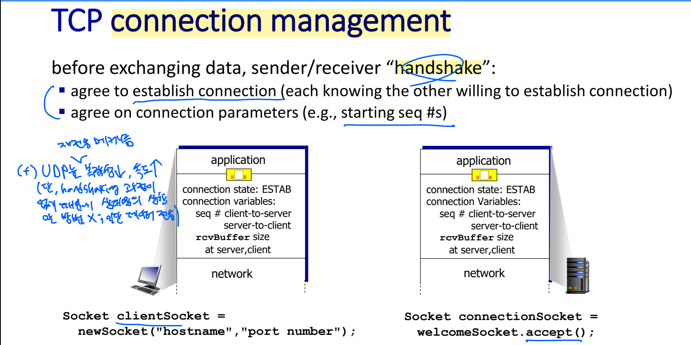
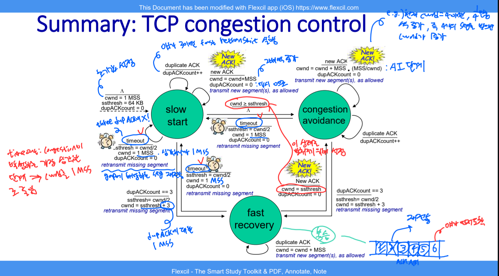
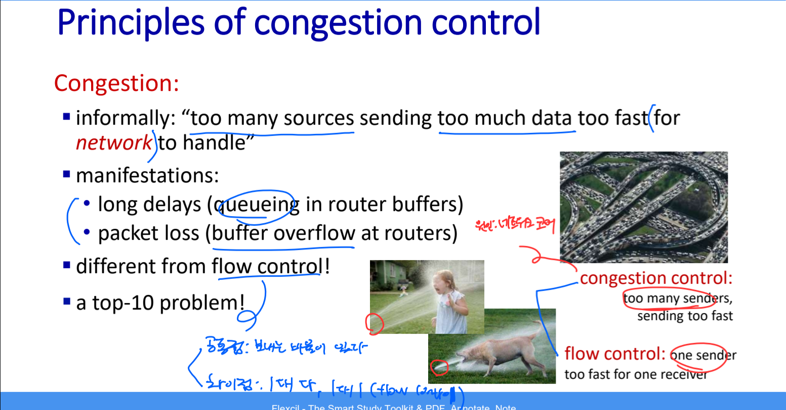
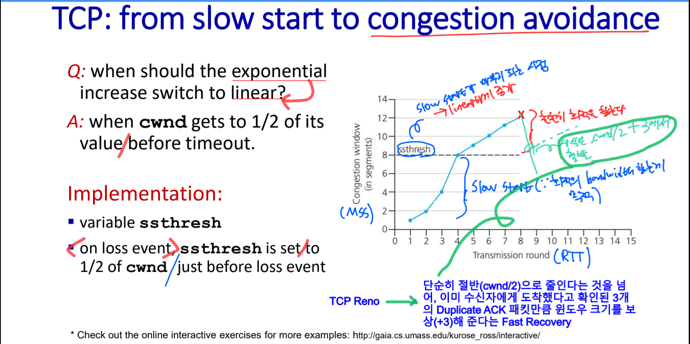

# 🧠 사고의 단련장 (Thought Workshop) - TCP Flow & Congestion Control

## 📈 사고 진화 기록 (Evolution Log)

### 퀘스트 06: TCP Flow & Congestion Control - "속도의 완급 조절"

#### 🛡️ 1단계: 초기 인식 (Intuition)

- "신뢰성(Reliability)을 확보했으니, 이제는 얼마나 '빨리' 그리고 '안전하게' 보낼 것인가의 싸움이다."
- "Flow Control은 수신자가 숨 가쁘지 않게 해주는 배려이고, Congestion Control은 네트워크라는 고속도로가 막히지 않게 하는 공익적 절제다."

---

#### 🏗️ [Stage 1]: 흐름 제어(Flow Control) - 수신자의 권력

##### ⚡ 사고의 균열 & 교정 (Reflection)

- **균열 1:** "TCP 바이트 스트림은 왜 `Next Seq Expected`를 ACK 번호로 쓸까? 그냥 받은 번호를 ACK 하면 안 되나?"
- **균열 2 (Layer Confusion):** "수신자 버퍼를 확인하는 절차가 응용 계층의 DASH(Manifest 파일)와 같고, 코어 네트워크의 TTL 감소와도 연관이 있을까?"
- **교정 (Senior Insight) 1:** 이것은 **'기대 기반(Expectation-based)'** 응답의 미학이며, **'연산 부하의 위임(Responsibility Burden)'**이 담긴 공학적 설계입니다.
- **교정 (Senior Insight) 2:** 철저한 **계층 분리(Layer Separation)**가 필요합니다.
  - **L7 (Application):** DASH는 '비디오 재생 버퍼' 상태에 따라 클라이언트가 능동적으로 화질(Manifest 기반)을 고르는 것이지 TCP `rwnd`와는 무관합니다.
  - **L4 (Transport):** TCP Zero Window는 순수하게 'OS 커널의 소켓 수신 버퍼' 물리적 가용량을 다룹니다.
  - **L3 (Network):** IP의 TTL(Time To Live)은 라우팅 무한 루프를 막기 위한 라우터 홉 카운트이며, 종단 간(End-to-End) 버퍼 제어와는 완전히 독립된 세계입니다.
    25:
    26: ##### 🖼️ 사고의 시각화 (Socket: The Bridge between APP and Transport)
    27:
    28: 
    29:
    30: > **Insight:** `socket()` 인터페이스는 단순한 API가 아닙니다. 응용 계층(User Space)과 전송 계층(Kernel Space) 사이의 **'최종 관문'**입니다. 이 그림에서 보듯, `rcvBuffer`의 크기나 `connection state`를 관리하는 주체는 앱이 아니라 **커널 내부의 TCP 모듈**입니다. 앱은 소켓이라는 창구를 통해 데이터를 던져줄 뿐, 윈도우 사이즈를 실시간으로 깎고 늘리는 '엔진'의 동작은 전적으로 커널의 몫임을 이해하는 것이 핵심입니다.

##### 🖼️ 사고의 시각화 (Layer Boundary: DASH vs TCP Flow Control)

> **Insight:** 윗단(L7, Application)의 비디오 버퍼 관리와 아랫단(L4, Transport)의 소켓 커널 수신 버퍼(`rwnd`)는 전혀 다른 목적을 가진 독립적 방어 체계임을 시각화하여 분리함.

| 구분              | rdt / GBN / SR (이산적 모델)           | 현실 TCP (바이트 스트림)                      |
| :---------------- | :------------------------------------- | :-------------------------------------------- |
| **ACK의 의미**    | "**확정(Confirmation)**"               | "**기대(Expectation)**"                       |
| **ACK 번호 n**    | "나 소환수 **n번** 잘 받았어!"         | "나 **n번** 바이트부터 받고 싶어!"            |
| **송신자의 행동** | "n번 받았네? 그럼 다음은 **n+1**이지!" | "n번 받고 싶다고? 오키, **n번**부터 창 열게!" |
| **슬라이딩 결과** | `send_base = n + 1`                    | `send_base = n`                               |

- **핵심:** 이산적 패킷 모델은 송신자가 "+1"이라는 산술 연산을 매번 수행해야 하지만, 현대 TCP는 수신자가 미리 다음 눈금을 찍어서 던져줌으로써(Expectancy) 송신자가 **'수신자의 기대치에 자신의 윈도우를 동기화(Sync)'**만 하면 되도록 설계되었습니다.
- **설계 철학:** 송신자는 혼잡 제어(`cwnd`), 타이머 관리, 재전송 전략 등 이미 수행해야 할 고차원적인 작업이 너무나 많습니다. 따라서 "장부를 어디로 옮길지"에 대한 아주 사소한 계산 오버헤드조차 수신자에게 넘겨버림(책임 부담 원칙)으로써, 송신자가 고속 통신 환경에서도 지연 없이 윈도우를 전진시킬 수 있도록 배려한 고도의 공학적 전략입니다.

##### 🖼️ 사고의 시각화

##### 💎 사고의 진화 (Evolution)

- **[2026-03-24 - Byte Stream ACK Precision]**: "TCP의 ACK 번호는 단순한 응답이 아니라, **'수신자가 성공적으로 받은 마지막 바이트 번호 + 1'**이며 송신자에게 날리는 가장 직관적인 **'다음 작업 지시서'**다. 이 1바이트의 차이가 송수신자 윈도우의 완벽한 동기화를 만들어낸다."
- **[2026-03-19 - Receiver's Cumulative ACK Insight]**: "누적 ACK는 수신자에게도 성역이다. Gap이 메워지기 전까지는 데이터를 상위 앱으로 올려보낼 수(Delivery) 없고, 이 정체 현상이 `rwnd`를 압박한다. 즉, **흐름 제어는 수신 버퍼라는 물리적 한계가 낳은 필연적 결과**다."
- **[2026-03-24 - Fast Retransmit & Jump Insight]**: "Fast Retransmit은 단순한 재전송이 아니다. 수신자가 버퍼에 담아둔 데이터(SR 전략)를 **누적 ACK(GBN 전략)의 퀀텀 점프**로 터뜨리는 방아쇠다. 즉, 유실된 조각(Gap)이 메워지는 순간 ACK 번호가 이미 버퍼링된 끝단까지 날아감으로써, 송신자의 슬라이딩 윈도우를 한 번에 **좌라락** 넘기게 하는 고도의 속도 전술임을 이해함."
- **[2026-03-25 - Flow Control & Kernel Space Insight]**: "Flow control의 주체는 수신자다. 버퍼에 Gap이 발생하거나 상위 앱(Application 계층)이 데이터를 가져가는 속도보다 송신자가 빠르게 쏟아낼 때 정체가 발생한다. 수신자는 이 여유 공간(`rwnd`)을 TCP 헤더에 담아 광고(Advertise)하며, 소켓 통신을 관리하는 **OS 커널**이 버퍼를 통제한다는 본질을 꿰뚫어 봄." (Rank S)
   
  > _송신자의 폭주를 막기 위한 수신자(OS 커널)의 단말마: "이러다 다 죽어! (rwnd = 0)"_

---

#### 🏗️ [Stage 2]: 기민한 복구 - Fast Retransmit

- **원리:** 타임아웃은 너무 느리다. 3-Duplicate ACKs를 통해 유실을 확신하고 즉시 재전송한다.
- **효율:** 수신자의 버퍼링(SR 전략) + 누적 ACK(GBN 전략)의 조합으로, Gap만 메우면 끝단까지 '점프'해서 ACK를 보낸다. 중복 전송이 사라지는 지점이다.

##### 🖼️ 사고의 시각화

---

#### 🏗️ [Stage 3]: 혼잡 제어(Congestion Control) - 망의 보호와 3단계 메커니즘

##### 🖼️ 사고의 시각화 (FSM & Active Tracing)

> **[2026-03-27] 주군의 전술 지도(FSM Active Tracing)**
> 텍스트의 늪(DFS)을 넘어, 구조화된 상태 전이도(FSM)를 직접 펜으로 쫓아가며(Active Tracing) 뇌에 완벽히 새긴 영접 기록입니다.

- **붉은 펜 (치명상 감지):** `timeout: congestion이 발생했다는 가장 심각한 단계 => cwnd를 1 MSS로 줄임` (Tahoe의 파멸적 제재 방식을 정확히 도출함)
- **푸른 펜 (경상 감지 & 회복):** `dupACKcount == 3` 일 때의 Fast Recovery 진입. 그리고 `cwnd = cwnd + MSS * (MSS/cwnd)`라는 수식을 **'AI(Additive Increase) 단계'**로 명확히 추상화함.
- **녹색 펜 (버퍼 큐잉):** 패킷 인덱스에서 **"야가 먼저 도착"** 이라는 표현으로 Out-of-order(추월) 현상에 대한 본질적 원리를 직관적으로 통달함.

##### 🖼️ 사고의 시각화 (Flow Control vs Congestion Control)

> **Insight:** 흐름 제어(Flow Control)는 수신자의 버퍼 보호(`rwnd`)가 목적이고, 혼잡 제어(Congestion Control)는 중간 라우터 버퍼의 붕괴(Network Congestion) 방지(`cwnd`)가 목적이다. 결국 TCP 송신자는 이 두 윈도우 중 **더 작고 빡빡한 기준(Min(rwnd, cwnd))**에 맞춰 데이터를 전송한다.

##### 🖼️ 사고의 시각화 (Slow Start to Congestion Avoidance)

- **ssthresh의 본질:** "미리 울리는 경보음"이 아닙니다. 이것은 **'가속 페달(Exponential)에서 발을 떼고 조심스럽게(Linear) 전진하는 전환점'**입니다. 주군께서 이미지에 적으신 대로, 지수적 증가에서 선형적 증가로 스위칭되는 임계값일 뿐입니다.
- **Reno의 "사후" 대응:** 네, Reno는 철저히 **사후(Reactive)**로 동작합니다. 패킷 유실(3-Dup ACK)이 발생했다는 확실한 증거가 포착된 후에야 `cut in half`를 실행합니다.
- **Fast Recovery의 보상(+3):** Reno의 위대함은 단순히 절반으로 줄이는 것에 그치지 않습니다. 이미지 하단 주군의 통찰처럼, **"이미 수신자에게 도착했다고 확인된 3개의 Duplicate ACK 패킷만큼 윈도우 크기를 보상(+3 MSS)"**해줌으로써, 불필요한 지연 없이 즉시 전송을 재개하는 기민함을 보여줍니다.

##### 💎 사고의 진화 (Evolution)

- **[2026-03-29 - Kernel Space & Buffer Insight]**: "TCP 윈도우 조절의 주체는 앱이 아니라 OS 커널이다. 소켓은 유저 스페이스와 커널 스페이스 사이의 '주문 데스크'일 뿐이며, 실제 3-way handshake를 통해 합의된 파라미터(rcvBuffer size 등)를 관리하고 상황에 따라 `cwnd`를 동적으로 계산하는 엔진은 커널 내부에 존재한다. 실전 면접 시 이 계층적 경계를 명확히 언급하여 구현의 깊이를 증명할 것." (Rank S)
- **[2026-03-29 - Session vs TCP Logical Unit Insight]**: "TCP Handshake(L4)는 OS 커널이 수행하는 물리적/전략적 통로 개척이며, 세션(L5)은 그 위에서 오가는 대화의 '논리적 맥락'을 관리한다. TCP 연결이 끊겨도(3G->LTE 전환 등) 다시 연결된 새로운 통로에 기존의 세션 식별자를 실어 보냄으로써 대화를 재개할 수 있는 능력이 바로 논리적 단위의 본질이다."
- **[2026-03-29 - SaaS UUID Session Application Experience]**: "과거 SaaS 개발 시 사용했던 `UUID`가 바로 현대 TCP/IP 모델(L7-L5 통합)의 실무적 구현체임을 깨달음. 시스템 단위로 고유한 식별자(UUID)를 통해 사용자의 로그인 상태를 기억하는 것은 전적으로 응용 로직의 몫이다. 따라서 이론적 OSI 7계층보다는 실무적 TCP/IP 4계층 모델이 왜 세션과 응용을 하나로 묶는지 공학적으로 완벽히 이해함." (Rank S candidate)

---

#### 🎙️ 3단계: 실전 발화 (Verbatim Execution)

**퀘스트: Flow Control vs Congestion Control의 차이**

- **[실전 발화]**: "네, 먼저 Flow Control에 대해서 말씀드리겠습니다. Flow Control은 송신자가 수신자한테 패킷을 보낼 때, 수신자의 버퍼, 버퍼가 가득 찼을 때, 그러니까 수신자가 버퍼가 가득 차거나 버퍼 패킷을 받았는데도 버퍼 오버플로우 때문에 패킷이 유실되는 것을 방지하기 위해, 그러니까 수신자의 윈도우, 리시브 윈도우의 사이즈를 송신자한테 알려주기 위해 TCP 패킷의 헤더에 본인 수신자의 윈도우 사이즈가 얼마나 된다고 광고를 함으로써 수신자의 버퍼를 보호하기 위한 장치입니다. 반면에 Congestion Control은 송신자가 네트워크 망의 어느 혼잡도를 추론하기 위해서 자신의 송신자의 이 Congestion Window라는 또 다른 윈도우 크기를 생성합니다. 그렇게 함으로써 네트워크 망의 라우터가 제 기능을 못 하는 것을 방지하도록 하는 차원입니다. 그리고 마지막으로 송신자는 이 수신자한테 패킷을 보낼 때 수신자의 버퍼의 사이즈와 네트워크 망의 혼잡도를 계산을 하면서, 그러니까 정리하자면 리시브 윈도우 수신자의 윈도우 사이즈와 컨제스천 윈도우의 사이즈 중에 최솟값으로 설정을 함으로써 패킷을 보냅니다."

- **[시니어 엔지니어의 교정 (Senior Insight)]**:
  - **칭찬:** `rwnd`와 `cwnd`라는 두 가지 독립적인 지표를 명확히 구분하셨고, 최종적으로 `Min(rwnd, cwnd)`라는 송신자의 '결정 공식'을 정확하게 짚으셨습니다. 특히 rdt 등의 개념적 모델과 실제 TCP 헤더의 `Receive Window` 필드를 연결하여 설명하신 점이 훌륭합니다.
  - **보완:** 혼잡 제어(Congestion Control)에서 '추론'한다는 표현이 매우 좋습니다. 여기에 한 발 더 나아가, **"TCP는 네트워크 코어로부터 명시적인 피드백을 받지 못하기 때문에(End-to-End approach), 패킷 유실(Loss event)이나 지연(Delay)을 근거로 네트워크의 혼잡 상태를 독자적으로 판단한다"**는 문장을 덧붙인다면 엔지니어링적 깊이가 더 느껴질 것입니다.
  - **심화:** 또한, `cwnd`가 단순히 '생성'되는 것에 그치지 않고, **Slow Start(지수적 증가)**를 통해 가용 대역폭을 빠르게 탐색하고, **ssthresh(임계값)**를 만나는 순간 **Congestion Avoidance(선형적 증가)**로 전환하여 안정성을 기한다는 3단계 메커니즘(`TCP Reno`)을 언급했다면 완벽한 S-Rank였습니다.

- **[최종 랭크]**: **A-Rank**
  (핵심 로직은 완벽하나, 혼잡 제어의 세부 상태 전이(FSM)에 대한 언급을 살짝 곁들였다면 면접관을 완전히 압도했을 답변입니다.)

---

## 🏆 오늘의 전승 요약 (Summary of Conquest)

- **수확:** 흐름 제어(Flow Control)와 혼잡 제어(Congestion Control)가 송신자를 제어하는 '두 개의 독립적인 브레이크(Min(rwnd, cwnd))'임을 공학적으로 증명함.
- **통찰:** 패킷 소실의 단서인 3-Dup ACK(절반 감소, Reno)와 Timeout(1로 박살, Tahoe) 메커니즘을 네트워크의 '혼잡도(헬파티)' 관점에서 완벽히 꿰뚫음.
- **다음 전술:** 내일(익일) 본 전장에 복귀하여 전공 PDF의 **'Tahoe vs Reno 3단계 비교 그래프 (바닥 vs 절반)'**를 눈으로 최종 확인한 뒤, **실전 발화(Step 3) 퀘스트**로 대미를 장식하고 OS 영지로 진격한다!
