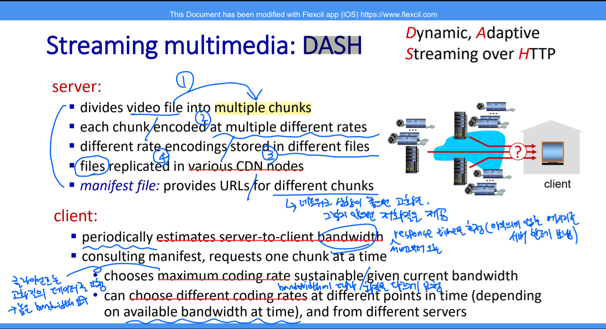
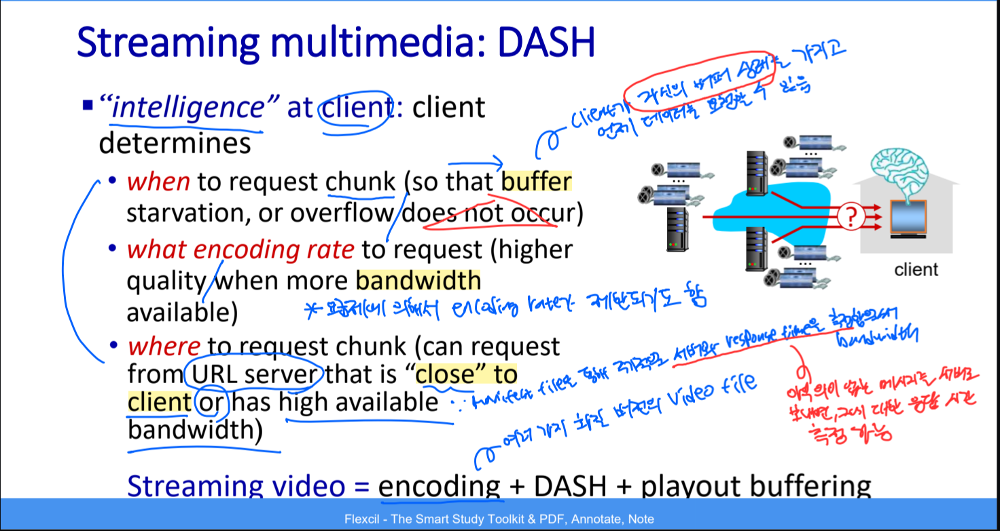
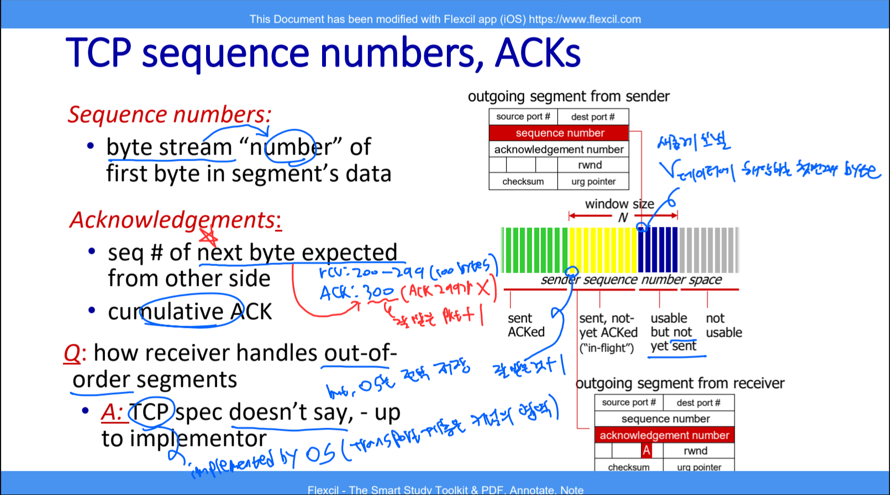
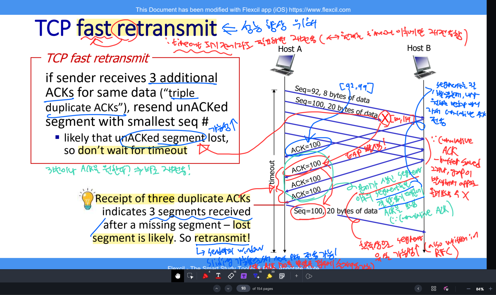

# 🧠 사고의 단련장 (Thought Workshop) - TCP Flow & Congestion Control

## 📈 사고 진화 기록 (Evolution Log)

### 퀘스트 06: TCP Flow & Congestion Control - "속도의 완급 조절"

#### 🛡️ 1단계: 초기 인식 (Intuition)

- "신뢰성(Reliability)을 확보했으니, 이제는 얼마나 '빨리' 그리고 '안전하게' 보낼 것인가의 싸움이다."
- "Flow Control은 수신자가 숨 가쁘지 않게 해주는 배려이고, Congestion Control은 네트워크라는 고속도로가 막히지 않게 하는 공익적 절제다."

---

#### 🏗️ [Stage 1]: 흐름 제어(Flow Control) - 수신자의 권력

##### ⚡ 사고의 균열 & 교정 (Reflection)

- **균열 1:** "TCP 바이트 스트림은 왜 `Next Seq Expected`를 ACK 번호로 쓸까? 그냥 받은 번호를 ACK 하면 안 되나?"
- **균열 2 (Layer Confusion):** "수신자 버퍼를 확인하는 절차가 응용 계층의 DASH(Manifest 파일)와 같고, 코어 네트워크의 TTL 감소와도 연관이 있을까?"
- **교정 (Senior Insight) 1:** 이것은 **'기대 기반(Expectation-based)'** 응답의 미학이며, **'연산 부하의 위임(Responsibility Burden)'**이 담긴 공학적 설계입니다.
- **교정 (Senior Insight) 2:** 철저한 **계층 분리(Layer Separation)**가 필요합니다.
  - **L7 (Application):** DASH는 '비디오 재생 버퍼' 상태에 따라 클라이언트가 능동적으로 화질(Manifest 기반)을 고르는 것이지 TCP `rwnd`와는 무관합니다.
  - **L4 (Transport):** TCP Zero Window는 순수하게 'OS 커널의 소켓 수신 버퍼' 물리적 가용량을 다룹니다.
  - **L3 (Network):** IP의 TTL(Time To Live)은 라우팅 무한 루프를 막기 위한 라우터 홉 카운트이며, 종단 간(End-to-End) 버퍼 제어와는 완전히 독립된 세계입니다.

##### 🖼️ 사고의 시각화 (Layer Boundary: DASH vs TCP Flow Control)

> **Insight:** 윗단(L7, Application)의 비디오 버퍼 관리와 아랫단(L4, Transport)의 소켓 커널 수신 버퍼(`rwnd`)는 전혀 다른 목적을 가진 독립적 방어 체계임을 시각화하여 분리함.

| 구분              | rdt / GBN / SR (이산적 모델)           | 현실 TCP (바이트 스트림)                      |
| :---------------- | :------------------------------------- | :-------------------------------------------- |
| **ACK의 의미**    | "**확정(Confirmation)**"               | "**기대(Expectation)**"                       |
| **ACK 번호 n**    | "나 소환수 **n번** 잘 받았어!"         | "나 **n번** 바이트부터 받고 싶어!"            |
| **송신자의 행동** | "n번 받았네? 그럼 다음은 **n+1**이지!" | "n번 받고 싶다고? 오키, **n번**부터 창 열게!" |
| **슬라이딩 결과** | `send_base = n + 1`                    | `send_base = n`                               |

- **핵심:** 이산적 패킷 모델은 송신자가 "+1"이라는 산술 연산을 매번 수행해야 하지만, 현대 TCP는 수신자가 미리 다음 눈금을 찍어서 던져줌으로써(Expectancy) 송신자가 **'수신자의 기대치에 자신의 윈도우를 동기화(Sync)'**만 하면 되도록 설계되었습니다.
- **설계 철학:** 송신자는 혼잡 제어(`cwnd`), 타이머 관리, 재전송 전략 등 이미 수행해야 할 고차원적인 작업이 너무나 많습니다. 따라서 "장부를 어디로 옮길지"에 대한 아주 사소한 계산 오버헤드조차 수신자에게 넘겨버림(책임 부담 원칙)으로써, 송신자가 고속 통신 환경에서도 지연 없이 윈도우를 전진시킬 수 있도록 배려한 고도의 공학적 전략입니다.

##### 🖼️ 사고의 시각화

##### 💎 사고의 진화 (Evolution)

- **[2026-03-24 - Byte Stream ACK Precision]**: "TCP의 ACK 번호는 단순한 응답이 아니라, **'수신자가 성공적으로 받은 마지막 바이트 번호 + 1'**이며 송신자에게 날리는 가장 직관적인 **'다음 작업 지시서'**다. 이 1바이트의 차이가 송수신자 윈도우의 완벽한 동기화를 만들어낸다."
- **[2026-03-19 - Receiver's Cumulative ACK Insight]**: "누적 ACK는 수신자에게도 성역이다. Gap이 메워지기 전까지는 데이터를 상위 앱으로 올려보낼 수(Delivery) 없고, 이 정체 현상이 `rwnd`를 압박한다. 즉, **흐름 제어는 수신 버퍼라는 물리적 한계가 낳은 필연적 결과**다."
- **[2026-03-24 - Fast Retransmit & Jump Insight]**: "Fast Retransmit은 단순한 재전송이 아니다. 수신자가 버퍼에 담아둔 데이터(SR 전략)를 **누적 ACK(GBN 전략)의 퀀텀 점프**로 터뜨리는 방아쇠다. 즉, 유실된 조각(Gap)이 메워지는 순간 ACK 번호가 이미 버퍼링된 끝단까지 날아감으로써, 송신자의 슬라이딩 윈도우를 한 번에 **좌라락** 넘기게 하는 고도의 속도 전술임을 이해함."
- **[2026-03-25 - Flow Control & Kernel Space Insight]**: "Flow control의 주체는 수신자다. 버퍼에 Gap이 발생하거나 상위 앱(Application 계층)이 데이터를 가져가는 속도보다 송신자가 빠르게 쏟아낼 때 정체가 발생한다. 수신자는 이 여유 공간(`rwnd`)을 TCP 헤더에 담아 광고(Advertise)하며, 소켓 통신을 관리하는 **OS 커널**이 버퍼를 통제한다는 본질을 꿰뚫어 봄." (Rank S)
   
  > _송신자의 폭주를 막기 위한 수신자(OS 커널)의 단말마: "이러다 다 죽어! (rwnd = 0)"_

---

#### 🏗️ [Stage 2]: 기민한 복구 - Fast Retransmit

- **원리:** 타임아웃은 너무 느리다. 3-Duplicate ACKs를 통해 유실을 확신하고 즉시 재전송한다.
- **효율:** 수신자의 버퍼링(SR 전략) + 누적 ACK(GBN 전략)의 조합으로, Gap만 메우면 끝단까지 '점프'해서 ACK를 보낸다. 중복 전송이 사라지는 지점이다.

##### 🖼️ 사고의 시각화

---

## 🏆 오늘의 전승 요약 (Summary of Conquest)

- **수확:** TCP의 바이트 스트림 기반 ACK 구조와 Fast Retransmit의 효율성을 공학적으로 증명함.
- **통찰:** 흐름 제어(`rwnd`)가 단순한 숫자의 전달이 아니라, 수신자 버퍼 내의 Gap 정체 현상과 물리적으로 연결되어 있음을 꿰뚫음.
- **다음 전술:** 이제 네트워크 전체의 체증을 관리하는 **혼잡 제어(Congestion Control, `cwnd`)**의 3단계 메커니즘(Slow Start, Avoidance, Recovery)으로 진격할 준비를 마침.
