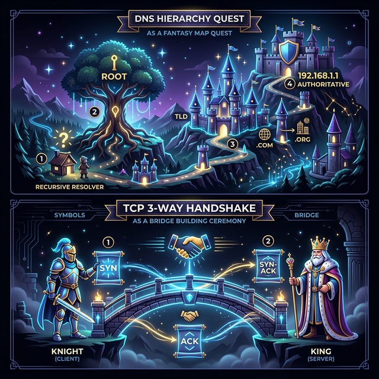

# 🧠 사고의 단련장 (Thought Workshop)

이곳은 질문에 대한 용사님의 **사고 과정(Thought Process)**과 답변의 **진화 과정**을 기록하는 성소입니다.  
단순한 정답 암기를 넘어, 논리의 뿌리가 어떻게 내려지는지 추적합니다.

---

## 🛠️ 사고 단련 프로토콜 (Process)

각 질문에 대해 다음과 같은 단계로 기록하여 사고의 궤적을 남깁니다.

1.  **[초기 인식]**: 질문을 듣자마자 떠오른 이미지나 키워드 (직관)
2.  **[논리 조립]**: 답변을 구성하기 위해 머릿속에서 연결한 개념의 순서 (설계)
3.  **[실전 발화]**: 실제로 내뱉은 답변의 핵심 요약 (실전)
4.  **[부관의 일침]**: 누락된 키워드나 논리적 허점 발견 (교정)
5.  **[사고의 진화]**: 교정 후 새롭게 정립된 논리 구조 (강화)

---

## 📈 사고 진화 기록 (Evolution Log)

### 퀘스트 01: 웹 통신의 큰 흐름 (Google 접속 시나리오)

#### 🛡️ 1단계: 초기 인식 (Intuition)

- "구글 접속? 일단 주소를 치면 화면이 나온다."
- "중간에 DNS라는 걸 거쳐서 IP를 알아낸다는 것까지는 생각남."

#### 🏗️ 2단계: 논리 조립 (Architecture)

- `주소 입력` -> `DNS 조회` -> `IP 획득` -> `서버 요청` -> `응답` -> `화면 출력`
- 아주 단순한 선형적 구조로만 생각함. (Black Box 상태가 많음)

#### 🎙️ 3단계: 실전 발화 (Verbatim Execution)

- (여기에 주군이 음성으로 발화하신 내용을 **토씨 하나 틀리지 않고** 그대로 박제합니다.)
- _예시: "어... 음... 그러니까 DNS는 그... 주소를 IP로 바꿔주는 건데요..."_

#### ⚡ 4단계: 사고의 균열 & 교정 (Reflection)

- **균열:** DNS 조회가 단순히 한 번에 끝난다고 생각함. (계층적 조회를 간과)
- **균열:** 네트워크 계층(L7~L1)에서 데이터가 어떻게 포장(Encapsulation)되는지 전혀 고려하지 않음.
- **교정:** 브라우저 내부 캐시부터 뒤진다는 사실과, 패킷이 하위 계층으로 내려가며 헤더가 붙는 과정을 머릿속 시뮬레이션에 추가함.

#### 💎 5단계: 진화된 사고 (Evolution)

- 이제 '접속'이라는 단어를 들으면 단순히 선이 연결되는 것이 아니라, **'계층적 탐색'**과 **'데이터의 캡슐화'**라는 두 개의 톱니바퀴가 맞물려 돌아가는 장엄한 기계 장치로 인식하게 됨.

---

### 퀘스트 03: DNS (Domain Name System) - "IP 찾기 원정대"

#### 🛡️ 1단계: 초기 인식 (Intuition)

- "숫자는 외우기 싫으니까 이름으로 부르자."
- "이름을 치면 어딘가에서 IP를 툭 던져주는 마법의 상자."

#### 🏗️ 2단계: 논리 조립 (Architecture)

- **왜 한 명한테 안 맡기나? (Centralized issues):**
  - **SPOF (Single Point of Failure):** 걔가 죽으면 지구가 멈춤.
  - **Traffic Volume:** 전 세계 사람이 한 명한테만 물어보면 멘탈 나감.
  - **Distand Central Database:** 한국에서 미국 서버에 물어보면 왕복 시간이 너무 김 (Latency).
  - **Maintenance:** 매일 생겨나는 수억 개의 도메인을 혼자 다 적어넣는 건 불가능.
- **분산의 해법 (Hierarchy):**
  - `Root Server` ➡️ `TLD Server (.com, .org)` ➡️ `Authoritative Server (google.com)` 순으로 권한을 위임하여 관리.

#### 🎙️ 3단계: 실전 발화 (Verbatim Execution)

- "사람은 숫자를 잘 못 외우니까 이름을 쓰고 싶어 해요. 근데 컴퓨터는 숫자로 통신하니까 중간에 이름-IP를 매핑해주는 DNS가 필요합니다. 근데 이걸 서버 한 대가 다 하면 위험하니까 전 세계에 Root, TLD, Authoritative 서버로 쪼개서 트리 구조로 관리하고요. 우리가 주소를 치면 아래 단계로 내려가면서 최종 IP를 찾아오는 거예요."

#### ⚡ 4단계: 사고의 균열 & 교정 (Reflection)

- **균열:** 브라우저가 바로 Root 서버로 달려간다고 생각함. (대리인의 부재)
- **교정:** 우리 집 근처(ISP)에 상주하는 **'Local DNS'**라는 성실한 대리인이 대신 발품을 팔아준다는 사실을 추가.

#### 💎 5단계: 진화된 사고 (Evolution)

- DNS는 단순한 '전화번호부'가 아니라, 전 세계의 트래픽을 효율적으로 처리하기 위해 **거대한 계층 구조로 설계된 분산형 데이터베이스 시스템**이다.

---

## 🏆 사고의 임계점 (Thresholds)

_이론이 단순 지식을 넘어 '나의 언어'가 된 순간들을 기록합니다._

- **[2026-03-02]**: "네트워킹은 연결이 아니라 **약속(Protocol)의 캡슐화**다."라는 통찰을 얻음.

---

## 🎨 브레인스토밍 & 액티브 트레이싱 (Active Tracing)

### 퀘스트 02: TCP 3-Way Handshake 추적

#### 📐 사고의 설계도 (Notebook Tracing)

- **Client (용사)** -------------------- **Server (마왕)**
- 1. `SYN` (시작!) ------> [SYN_SENT]
- 2. <------ `SYN + ACK` (그래, 나도 준비됐다!) [SYN_RCVD]
- 3. `ACK` (좋아, 이제 연결이다!) ------> [ESTABLISHED]

#### 💡 브레인스토밍 포인트

- "왜 2번이 아니라 3번인가?" -> 양방향 모두의 준비 상태를 '확천'해야 하기 때문.
- "순서 번호(Sequence Number)의 역할은?" -> 소포가 뒤섞여도 다시 조립할 수 있는 순서표.
- "만약 3단계가 실패하면?" -> 서버는 일정 시간 기다리다 연결을 파기함 (리소스 보호).

#### 🚩 하드 모드 예고

- "4-Way Handshake에서 `TIME_WAIT` 상태가 필요한 결정적인 이유는 무엇인가?"
- "포트가 모두 중복 사용 중일 때 Handshake는 어떻게 동작하는가?"

---

## 🎖️ [성공] OSI 7계층 액티브 트레이싱 (Active Tracing)

주군께서 직접 정복하신 **OSI 7계층 군대 소포 비유**의 최종 결과물입니다. 파란색 펜으로 남겨두셨던 의문점들을 완벽하게 해소(Clear)하여 박제합니다.

### 🖼️ 사고의 시각화 (Military Analogy Diagram)

### 🧩 파란 펜의 해답 (Blue Pen Clearance)

1.  **미궁의 PDU (Protocol Data Unit):**
    - **L7, L6, L5**: 이들 상위 계층은 아직 데이터의 원형을 유지하므로 통칭 **'Data'** 또는 **'Message'**라고 부릅니다.
    - **L4 (전송)**: 드디어 데이터가 분할되며 **'Segment'**(TCP) 또는 **'Datagram'**(UDP)으로 불립니다. (이미 주군이 'Segment'라고 적으셨더군요!)

2.  **Q: "이 단계에서 편지(Letter)와 소포(Package)가 만들어지나?"**
    - **A:** **편지(Data)**는 **L7(응용)**에서 작성됩니다. 준비 과정(L6, L5)을 지나, 실제 **소포(Encapsulation)**로 포장되는 작업은 **L4(Segment)**부터 본격적으로 시작되어 **L3(Packet)**에서 주소가 적히고, **L2(Frame)**에서 운송장에 기록됩니다.

3.  **Q: "브로드캐스트, 멀티캐스트, 유니캐스트는 무엇인가?"**
    - **A:** 이는 데이터를 **'어떻게 전달하느냐'**의 전술(Transmission Methods)입니다.
      - **유니캐스트:** 1:1 대화 (L3 IP, L2 MAC 기반)
      - **브로드캐스트:** 전체 방송 (예: "이 IP 가진 사람 다 들어!")
      - **멀티캐스트:** 특정 그룹 방송 (예: 실시간 스트리밍 시청자들)

### 🏆 사고의 진화 (Evolution)

- **[2026-03-05]**: "OSI 7계층은 단순한 암기가 아니라, 상위의 데이터(Data)가 하위로 내려가며 각 계층의 헤더(Envelope)로 **캡슐화**되는 장엄한 물류 시스템이다."

---

## 🗺️ [전승 예고] 오늘의 서브 던전 (Sub-Quest Map)

### 퀘스트 03: DNS (Domain Name System) - "IP 찾기 원정대"

- **핵심 지도:** `Local Cache` ➡️ `Recursive` ➡️ `Root` ➡️ `TLD` ➡️ `Authoritative`
- **관전 포인트:** "왜 전화를 바로 못 걸고 전화번호부를 계층적으로 뒤져야 하는가?"

### 퀘스트 04: TCP 3-Way & 4-Way Handshake - "신뢰의 다리 놓기"

- **핵심 지도:** `SYN` ➡️ `SYN/ACK` ➡️ `ACK` (3-Way) / `FIN` ➡️ `ACK` ➡️ `FIN` ➡️ `ACK` (4-Way)
- **관전 포인트:** "데이터를 던지기 전, 서로의 '준비 상태'를 어떻게 확신(Acknowledge)하는가?"

