# 🧠 사고의 단련장 (Thought Workshop)

이곳은 질문에 대한 용사님의 **사고 과정(Thought Process)**과 답변의 **진화 과정**을 기록하는 성소입니다.  
단순한 정답 암기를 넘어, 논리의 뿌리가 어떻게 내려지는지 추적합니다.

---

## 🛠️ 사고 단련 프로토콜 (Process)

각 질문에 대해 다음과 같은 단계로 기록하여 사고의 궤적을 남깁니다.

1.  **[초기 인식]**: 질문을 듣자마자 떠오른 이미지나 키워드 (직관)
2.  **[논리 조립]**: 답변을 구성하기 위해 머릿속에서 연결한 개념의 순서 (설계)
3.  **[실전 발화]**: 실제로 내뱉은 답변의 핵심 요약 (실전)
4.  **[부관의 일침]**: 누락된 키워드나 논리적 허점 발견 (교정)
5.  **[사고의 진화]**: 교정 후 새롭게 정립된 논리 구조 (강화)

---

## 📈 사고 진화 기록 (Evolution Log)

### 퀘스트 01: 웹 통신의 큰 흐름 (Google 접속 시나리오)

#### 🛡️ 1단계: 초기 인식 (Intuition)

- "구글 접속? 일단 주소를 치면 화면이 나온다."
- "중간에 DNS라는 걸 거쳐서 IP를 알아낸다는 것까지는 생각남."

#### 🏗️ 2단계: 논리 조립 (Architecture)

- `주소 입력` -> `DNS 조회` -> `IP 획득` -> `서버 요청` -> `응답` -> `화면 출력`
- 아주 단순한 선형적 구조로만 생각함. (Black Box 상태가 많음)

#### 🎙️ 3단계: 실전 발화 (Verbatim Execution)

- (여기에 주군이 음성으로 발화하신 내용을 **토씨 하나 틀리지 않고** 그대로 박제합니다.)
- _예시: "어... 음... 그러니까 DNS는 그... 주소를 IP로 바꿔주는 건데요..."_

#### ⚡ 4단계: 사고의 균열 & 교정 (Reflection)

- **균열:** DNS 조회가 단순히 한 번에 끝난다고 생각함. (계층적 조회를 간과)
- **균열:** 네트워크 계층(L7~L1)에서 데이터가 어떻게 포장(Encapsulation)되는지 전혀 고려하지 않음.
- **교정:** 브라우저 내부 캐시부터 뒤진다는 사실과, 패킷이 하위 계층으로 내려가며 헤더가 붙는 과정을 머릿속 시뮬레이션에 추가함.

#### 💎 5단계: 진화된 사고 (Evolution)

- 이제 '접속'이라는 단어를 들으면 단순히 선이 연결되는 것이 아니라, **'계층적 탐색'**과 **'데이터의 캡슐화'**라는 두 개의 톱니바퀴가 맞물려 돌아가는 장엄한 기계 장치로 인식하게 됨.

---

### 퀘스트 03: DNS (Domain Name System) - "IP 찾기 원정대"

#### 🛡️ 1단계: 초기 인식 (Intuition)

- "숫자는 외우기 싫으니까 이름으로 부르자."
- "이름을 치면 어딘가에서 IP를 툭 던져주는 마법의 상자."

#### 🏗️ 2단계: 논리 조립 (Architecture)

- **왜 한 명한테 안 맡기나? (Centralized issues):**
  - **SPOF (Single Point of Failure):** 걔가 죽으면 지구가 멈춤.
  - **Traffic Volume:** 전 세계 사람이 한 명한테만 물어보면 멘탈 나감.
  - **Distand Central Database:** 한국에서 미국 서버에 물어보면 왕복 시간이 너무 김 (Latency).
  - **Maintenance:** 매일 생겨나는 수억 개의 도메인을 혼자 다 적어넣는 건 불가능.
- **분산의 해법 (Hierarchy):**
  - `Root Server` ➡️ `TLD Server (.com, .org)` ➡️ `Authoritative Server (google.com)` 순으로 권한을 위임하여 관리.

#### 🎙️ 3단계: 실전 발화 (Verbatim Execution)

- "네, 먼저 DNS 서버를 중앙집중형이 아닌 계층적 분산 구조로 설계한 이유는 여러 가지 장점이 있기 때문입니다. 먼저 첫 번째 분산... 계층적 분산 구조, 그러니까 하이러키 구조죠. 그걸로 하면 먼저 SPOF, 단일 지점의 실패를 막을 수 있습니다. 이게 무슨 말이냐고 하냐면... 예를 들어 서버가 하나의 집중된 공간에 있다고 했을 때, 거기서 화재가 났다거나, 예전 카카오 화재 사건이죠. 거기서 만약 데이터베이스나 어떤 모든 DNS 기록들이 거기 있는데 서버가 다운되거나 불타버리면 모든 데이터가 소실되고 심지어 네트워크도 다운이 됩니다. 그래서 카카오톡이 아예 먹통이 되고 안 되는 경우였죠. 그리고 두 번째로는 일단은 계층적 분산 구조로 되면 트래픽이 몰리는 것을 막을 수 있습니다. 인터넷은 보통 네트워크 오브 네트워크로서... 네, 많은 유저들이 엔드 시스템에서 네트워크 통신을 동시에 다발적으로 합니다. 근데 만약 트래픽이 하나에 몰리게 되면 관리하기도 힘들고 그 쿼리들을 레코드 테이블에 기록하기도 힘듭니다. 따라서 계층형 분산 구조로 되어 있으면 유저가 쿼리를 날리는 리소스들을 기록하기가 쉽습니다."

#### ⚡ 4단계: 사고의 균열 & 교정 (Reflection)

- **균열:** 트래픽이 몰리는 상황에서 '레코드 테이블에 기록하기 힘들다'는 표현은 서버의 처리 능력보다는 대역폭 포화와 중앙 서버의 부하 집중 관점으로 설명하는 것이 더 명확함.
- **교정:** 물리적 거리(Latency)와 관리의 확장성(Scalability) 관점을 추가하여 4대 공학적 가치(안정성, 부하분산, 속도, 확장성)를 완성함.

- **균열:** 브라우저가 바로 Root 서버로 달려간다고 생각함. (대리인의 부재)
- **교정:** 우리 집 근처(ISP)에 상주하는 **'Local DNS'**라는 성실한 대리인이 대신 발품을 팔아준다는 사실을 추가.

#### 💎 5단계: 진화된 사고 (Evolution)

- DNS는 단순한 '전화번호부'가 아니라, 전 세계의 트래픽을 효율적으로 처리하기 위해 **거대한 계층 구조로 설계된 분산형 데이터베이스 시스템**이다. 특히 **Iterative Query**와 **Caching**의 조화는 상위 계층 서버의 부하를 최소화하면서도 빠른 응답을 가능케 하는 분산 시스템의 정수다.

---

### 퀘스트 04: DNS의 심화 메커니즘 - "질의 방식과 레코드의 철학"

#### 🛡️ 1단계: 초기 인식 (Intuition)

- "물어보는 방법에도 여러 가지가 있다? 재귀(Recursive)는 내가 다 해주는 것, 반복(Iterative)은 알려만 주는 것."
- "레코드는 전화번호부의 한 줄 한 줄을 구성하는 데이터 양식."

#### 🏗️ 2단계: 논리 조립 (Architecture)

- **질의 방식의 차이 (Iterative vs Recursive):**
  - **Recursive:** Root 서버가 최종 IP까지 직접 알아다 줌 ($O(N)$의 깊이만큼 상위 서버에 부하 집중 ➡️ 거의 사용 안 함).
  - **Iterative:** Root는 다음 갈 곳(TLD)만 알려주고, 발품은 Local DNS가 파는 구조 (상위 서버의 부하 분산 ➡️ 인터넷의 표준).
  - **Bridge:** 이 구조는 하드웨어의 **Memory Hierarchy (L1, L2 Cache)** 및 **JPA의 1차 캐시** 철학(가까운 곳에서 해결, 멀리 가기 최소화)과 맞닿아 있음.
- **레코드 타입의 전술:**
  - **Type A:** 호스트네임 ➡️ IP 주소 매핑 (실제 좌표).
  - **Type NS:** 도메인 ➡️ Authoritative 네임 서버 명칭 (사령부 안내).
  - **Type CNAME:** 별명 ➡️ 진짜 이름 (관리의 용이성).
  - **Type MX:** 메일 서버 정보 (특수 목적 트래픽 관리).
- **DNS Registrar (등록):** 새로운 도메인 등록 시 TLD에 **NS 레코드**와 **A 레코드(Glue Record)**를 쌍으로 넣어 순환 참조(Circular Reference)를 방지함.

#### 🎙️ 3단계: 실전 발화 (Verbatim Execution)

- "네 보통 유저가 구글닷컴이라든가 어떤 에듀 사이트 같은 곳에 쿼리를 날리면 브라우저에 있는 로컬 DNS 서버는 네 보통 TLD 서버에 기록이 캐싱으로 기록이 되어 있습니다. 이 말은 즉 .com이라든가 .org 혹은 .edu 같은 TLD 서버는 바로 루트로 유저가 로컬 DNS 서버가 유저로 가서 이게 있는지 묻지 않고 바로 TLD로 갈 수 있다는 거죠. 그래서 TLD DNS 서버로 가면 이 굴루 레코드라고 네임 서버와 그러니까 이 네임으로는 호스트 네임으로는 도메인 이름이 있고 구글닷컴 같은 도메인이죠. 그리고 밸류로는 네 네임 서버 예를 들면 ns1.google.com 같은 네임 서버가 있고요. 그다음에는 A 레코드를 주는데 A 레코드의 호스트 네임은 방금 네임 서버의 밸류로 받은 네임 서버 호스트 네임과 밸류는 그 네임 서버의 실제 IP 주소를 건네줍니다. 그러면 그 굴루 레코드에 포함된 네임 서버 레코드와 A 레코드를 TLD DNS 서버가 로컬 DNS 서버한테 전달을 해주고 로컬 DNS 서버는 그렇기 때문에 정확하게 권위 있는 DNS 서버로 찾아갈 수가 있습니다. 만약에 굴루 레코드에서 하나의 레코드라도 빠지면 정확히 권위 있는 DNS 서버로 찾아가기가 힘들기 때문에 TLD 서버는 굴루 레코드를 마련함으로써 최적의 경로를 갈 수 있게 만들어줍니다."

#### ⚡ 4단계: 사고의 균열 & 교정 (Reflection)

- **균열:** TLD 서버가 단순히 정보를 준다고만 생각했으나, 실제로는 '도메인 이름 -> NS 명칭'과 'NS 명칭 -> IP'라는 두 가지 정보가 원자적(Atomic)으로 제공되어야 함을 확인.
- **교정:** Glue Record의 정수를 '순환 참조 방지'와 '다음 사령부의 좌표 확정'으로 정의하며 논리를 완성함.

#### ⚡ 4단계: 사고의 균열 & 교정 (Reflection)

- **균열:** TLD가 최종 IP를 안다고 착각함.
- **교정:** TLD는 최종 목적지가 아닌 **'다음 사령부(Authoritative)의 이름(NS)과 주소(A)'**를 알려주는 표지판 역할을 수행함을 명시 (Glue Record).

#### 💎 5단계: 진화된 사고 (Evolution)

- **[2026-03-08]**: "DNS는 단순한 전송을 넘어, **'권한의 위임(Delegation)'**과 **'부하의 분산'**을 통해 수십억 개의 엔티티를 관리하는 장엄한 공학적 설계물이다."

#### 🗺️ 전술적 논리 합성 (Network Logic Synthesis)

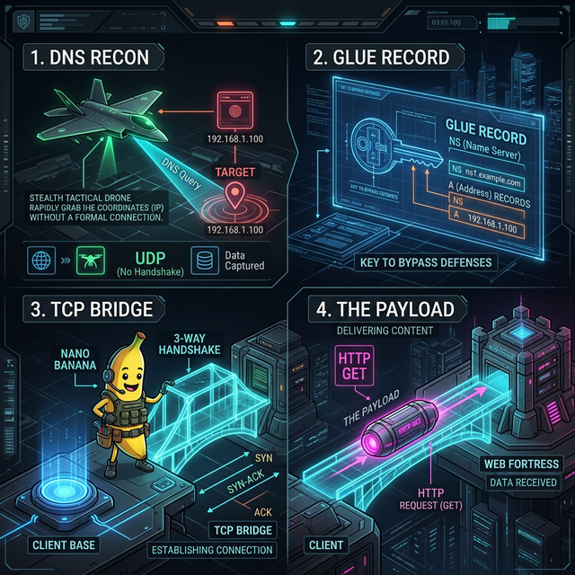

#### 🖼️ 사고의 시각화 (Military Analogy Diagram)

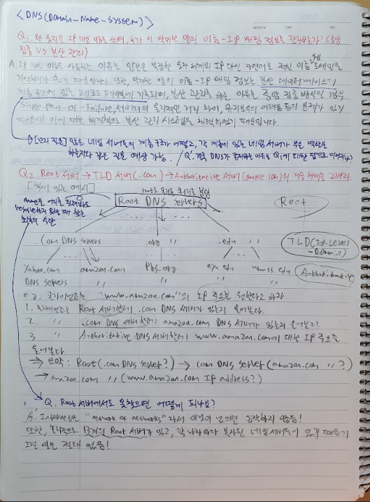

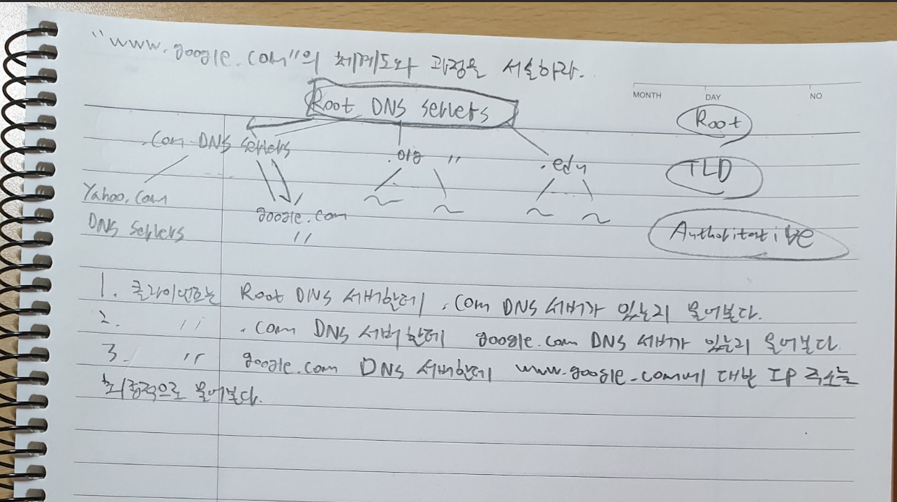

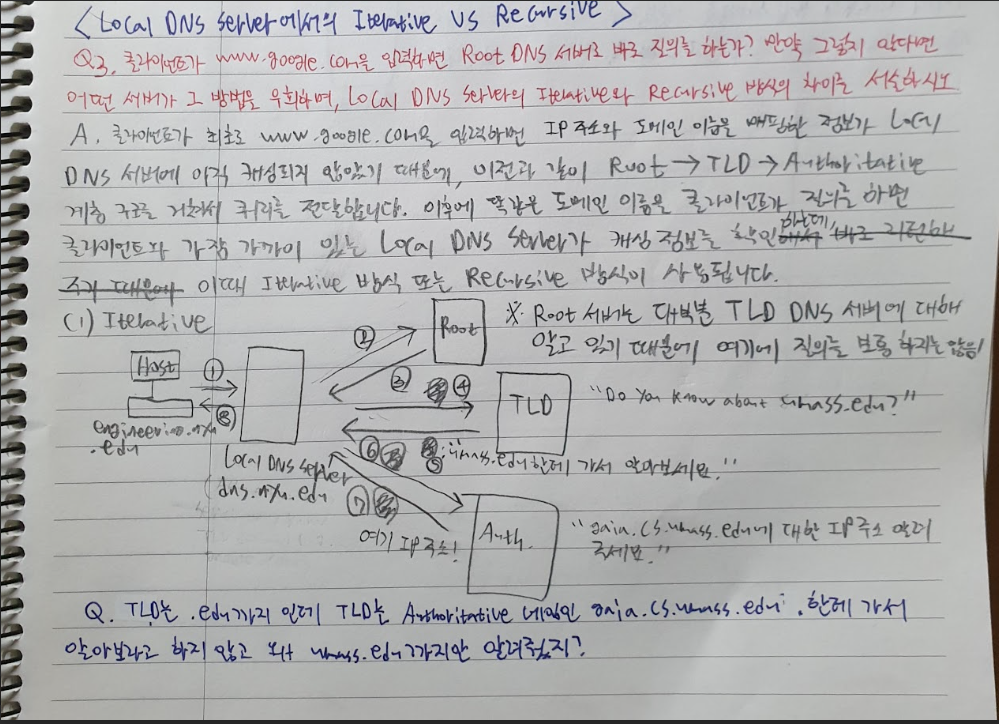

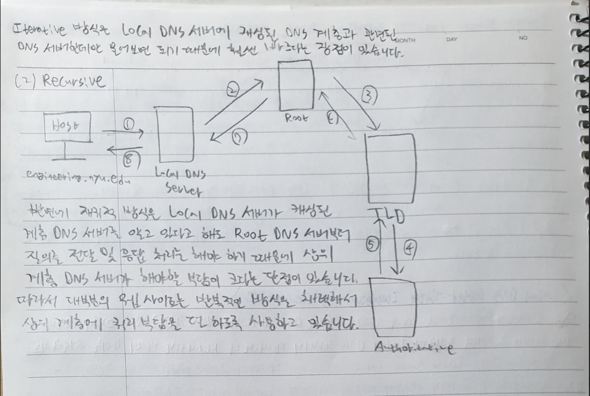

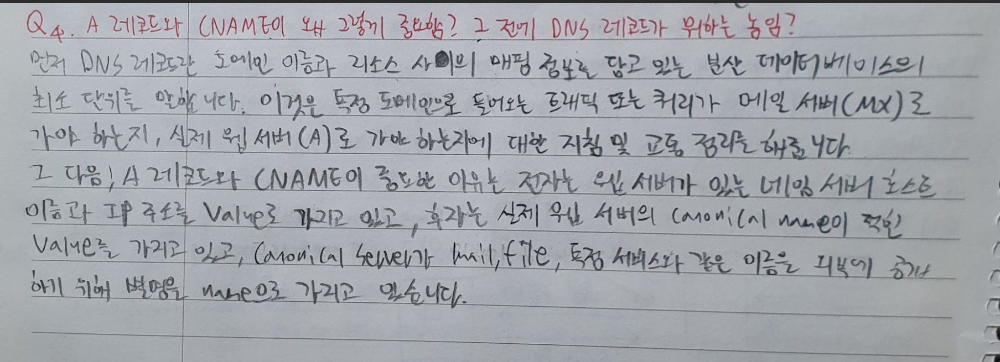

---

## 🏆 사고의 임계점 (Thresholds)

_이론이 단순 지식을 넘어 '나의 언어'가 된 순간들을 기록합니다._

- **[2026-03-02]**: "네트워킹은 연결이 아니라 **약속(Protocol)의 캡슐화**다."라는 통찰을 얻음.

---

## 🎨 브레인스토밍 & 액티브 트레이싱 (Active Tracing)

### 퀘스트 02: TCP 3-Way Handshake 추적

#### 🎙️ 3단계: 실전 발화 (Verbatim Execution)

- "네 먼저 TCP 연결은 클라이언트와 서버 간의 신뢰가 있는 프로토콜 연결을 지향하기 때문에 TCP 연결을 씁니다. 먼저 시간의 순서의 흐름에 따라 패킷의 전달 및 받음은 다음과 같습니다. 클라이언트가 먼저 서버한테 SYN 플래그가 있는 패킷을 전달합니다. 거기에 그 패킷은 세그먼트죠. TCP는 세그먼트가 하나의 단위이기 때문에 그 세그먼트에 있는 시퀀스 X라고 가정해 봅시다. 그러니까 X 시퀀트가 붙어 있는 SYN 플래그를 서버한테 전달해 줍니다. 그럼 서버는 그 패킷을 받고 받았다는 것을 클라이언트한테 알리기 위해 X+1 시퀀트 번호가 있는 ACK의 그 플래그와 그리고 마찬가지로 서버도 클라이언트한테 SYN 플래그를 보내기 위해 시퀀스 Y라는 고유적인 번호를 붙여서 다시 클라이언트한테 전달합니다. 만약에 여기서 2-way만 된다면 클라이언트는 이 SYN 패킷과 ACK 패킷을 받았는데 서로 간의 상태는 모르기 때문에... 그래서 서버는 클라이언트가 제대로 패킷을 받았는지 알 방도가 없습니다. 네 알 방도가 없고요. 근데 이때 올드 듀플리케이트, 그러니까 오래됐는데 다시 복제된 패킷을 클라이언트 쪽으로 보내면 이미 서버는 클라이언트의 SYN 패킷을 받음으로써 연결을 받았다는 것을 알았는데 또 연결을 했으면 이 클라이언트가 어떤 문제가 발생했는가 혹은 그런지도 모른 채 서버는 그냥 수동적으로 받아서 다시 연결을 합니다. 그러면 이미 연결을 했는데 또 연결을 하기 때문에 네트워크 오버헤드가 발생하기 때문에 시스템적으로 혼란을 주는 것 같다고 생각합니다. 그래서 이를 해결하기 위해 다시 클라이언트는 서버로부터 받은 패킷을 제대로 받았다고 서버한테 알리기 위해 ACK 플래그 패킷에 Y+1이라는 시퀀스 번호를 서버한테 전달해 줍니다. 그럼 서버는 그 ACK을 받고 아 얘가 제대로 받았구나 하면서 클라이언트와 서버가 정상적으로 연결이 되면서 3-way handshake가 발생하는 겁니다."

#### ⚡ 4단계: 사고의 균열 & 교정 (Reflection)

- **균열:** 2-way 상황에서 '네트워크 오버헤드'를 혼란의 주원인으로 꼽았으나, 실제로는 서버가 불필요하게 ESTABLISHED 상태로 진입하여 자원을 낭비하는 'Half-open' 문제가 더 치명적임.
- **교정:** 3단계가 있음으로써 클라이언트가 서버의 SYN/ACK를 자신의 상태와 대조(Validation)하여 '진짜 현재 연결 시도'인지 확인할 수 있다는 점을 명확히 함.

#### 🚩 하드 모드 예고

- "4-Way Handshake에서 `TIME_WAIT` 상태가 필요한 결정적인 이유는 무엇인가?"
- "포트가 모두 중복 사용 중일 때 Handshake는 어떻게 동작하는가?"

---

## 🎖️ [성공] OSI 7계층 액티브 트레이싱 (Active Tracing)

주군께서 직접 정복하신 **OSI 7계층 군대 소포 비유**의 최종 결과물입니다. 파란색 펜으로 남겨두셨던 의문점들을 완벽하게 해소(Clear)하여 박제합니다.

### 🖼️ 사고의 시각화 (Military Analogy Diagram)

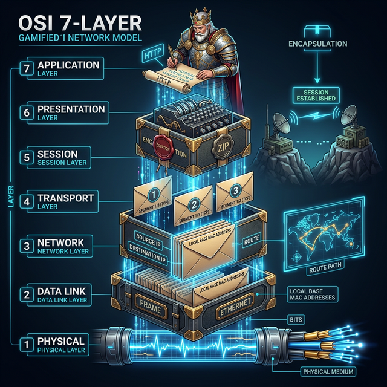

### 🧩 파란 펜의 해답 (Blue Pen Clearance)

1.  **미궁의 PDU (Protocol Data Unit):**
    - **L7, L6, L5**: 이들 상위 계층은 아직 데이터의 원형을 유지하므로 통칭 **'Data'** 또는 **'Message'**라고 부릅니다.
    - **L4 (전송)**: 드디어 데이터가 분할되며 **'Segment'**(TCP) 또는 **'Datagram'**(UDP)으로 불립니다. (이미 주군이 'Segment'라고 적으셨더군요!)

2.  **Q: "이 단계에서 편지(Letter)와 소포(Package)가 만들어지나?"**
    - **A:** **편지(Data)**는 **L7(응용)**에서 작성됩니다. 준비 과정(L6, L5)을 지나, 실제 **소포(Encapsulation)**로 포장되는 작업은 **L4(Segment)**부터 본격적으로 시작되어 **L3(Packet)**에서 주소가 적히고, **L2(Frame)**에서 운송장에 기록됩니다.

3.  **Q: "브로드캐스트, 멀티캐스트, 유니캐스트는 무엇인가?"**
    - **A:** 이는 데이터를 **'어떻게 전달하느냐'**의 전술(Transmission Methods)입니다.
      - **유니캐스트:** 1:1 대화 (L3 IP, L2 MAC 기반)
      - **브로드캐스트:** 전체 방송 (예: "이 IP 가진 사람 다 들어!")
      - **멀티캐스트:** 특정 그룹 방송 (예: 실시간 스트리밍 시청자들)

### 🏆 사고의 진화 (Evolution)

- **[2026-03-11]**: "TCP는 **두 개의 단방향 신뢰 통로가 하나로 묶인 전이중(Full-Duplex) 성벽**이다. 송신자가 패복(Packet Loss)을 책임지는 '단방향적 책임감(Sender Responsibility)'과, 네트워크 전체를 무방향 그래프로 연결해 기동성을 확보한 '양방향적 포워딩(Network Forwarding)'이 조화를 이뤄 현대 인터넷의 대동맥을 완성한다." (S-Rank 달성)

- **[2026-03-11] (Senior Insight)**: "TCP(L4)의 '연결'은 무거운 짐을 안전하게 나르는 **성실한 문지기**의 성문 개방이고, 세션층(L5)의 '세션'은 끊긴 대화를 이어가고 신원을 보증하는 **영리한 집사**의 대화 관리다." (L4와 L5의 추상화 차이 정립)

#### 🔐 인증 전술의 현대적 해석 (Auth Archetypes)

- **세션(Session):** 서버가 상태를 기억하는 '중앙 통제형'. 대량 유저 접속 시 서버 부하 및 확장성(Scalability) 이슈 발생 가능. (해결책: Redis 세션 서버)
- **쿠키(Cookie):** 클라이언트에 저장되는 '범용 운송수단'. XSS 방어를 위해 `HttpOnly`, `Secure` 플래그 설정이 필수적임.
- **JWT(JSON Web Token):** 서버가 상태를 잊어도 신분증의 서명만 확인하면 되는 '분산 무상태성(Stateless)'. 확장성이 뛰어나나, 탈취 시 무효화가 어려운 '토큰 취소(Revocation)' 문제를 해결하기 위해 `Refresh Token` 전략이 수반됨.

---

---

## 🗺️ [전승 예고] 오늘의 서브 던전 (Sub-Quest Map)

### 퀘스트 03: DNS (Domain Name System) - "IP 찾기 원정대"

- **핵심 지도:** `Local Cache` ➡️ `Recursive` ➡️ `Root` ➡️ `TLD` ➡️ `Authoritative`
- **관전 포인트:** "왜 전화를 바로 못 걸고 전화번호부를 계층적으로 뒤져야 하는가?"

### 퀘스트 04: TCP 3-Way & 4-Way Handshake - "신뢰의 다리 놓기"

#### 🛡️ 1단계: 초기 인식 (Intuition)

- "데이터를 보내기 전에 서로 마음이 맞는지 확인하는 '예절' (3-Way)."
- "헤어질 때도 뒷정리를 깔끔하게 하는 '품격' (4-Way)."
- "왜 바로 안 보내고 복잡하게 구나? -> '신뢰'가 생명인 TCP니까."

#### 🏗️ 2단계: 논리 조립 (Architecture)

- **3-Way (연결):**
  - `SYN` ➡️ `SYN/ACK` ➡️ `ACK` 의 3단계.
  - 양방향 송수신 가능 여부를 최종 확인하는 '결혼식' 같은 절차.
- **4-Way (종료):**
  - `FIN` ➡️ `ACK` ➡️ `FIN` ➡️ `ACK` 의 4단계.
  - 한쪽이 끝났다고 해도 반대쪽의 데이터가 남았을 수 있음을 배려하는 '매너'.
  - **TIME_WAIT:** 마지막 보낸 ACK가 유실될 경우를 대비한 '자비로운 기다림'.

#### 🎙️ 3단계: 실전 발화 (Verbatim Execution)

- (도서관 내부 수련 중으로 텍스트 설계로 대체)
- "TCP는 신뢰성을 보장해야 합니다. 그래서 데이터를 던지기 전에 3-Way Handshake로 서로 연결이 가능한지 확인하고, 끝나면 4-Way로 우아하게 종료합니다. 특히 종료할 때 `TIME_WAIT` 상태가 있어서 혹시 모를 패킷 유실이나 중복 패킷 문제를 방지하는 게 핵심입니다."

#### ⚡ 4단계: 사고의 균열 & 교정 (Reflection)

- **균열 1:** "DNS 서버에 도착하면 바로 3-Way로 연결하는 건가?" (전술적 선후 관계 혼동)
- **교정:**
  1. **DNS(UDP):** 우선 연락처(IP)만 빨리 따옵니다. DNS 질의는 보통 **UDP**를 사용하므로, 3-Way Handshake라는 복잡한 절차 없이 질문-답변의 단발성 통신으로 끝납니다.
  2. **Glue Record의 활약:** TLD 서버가 "그 주소는 ns1.google.com이 알아(NS)"라고 알려줄 때, 그 서버의 주소인 "ns1.google.com은 1.2.3.4야(A)"라고 함께 던지는 것이 **Glue Record**입니다. 이 덕분에 로컬 DNS는 막힘없이 최종 목적지(Authoritative Server)까지 도달합니다.
  3. **TCP(3-Way):** 드디어 최종 IP(구글 서버)를 손에 넣은 뒤, **구글 웹 서버**로 달려가서 성문을 열어달라고(3-Way) 요청합니다.
  4. **HTTP(Message):** 성문이 열리면(ESTABLISHED) 그제서야 준비한 캡슐(GET 메시지)을 전송합니다.

- **균열 2 (Deep Dive): "왜 하필 3번(3-Way)인가? 2번이나 4번은 안 되나?"**
- **교정 (S-Rank Answer):**
  - **양비론(Bidirectional Confidence):** A는 B가 들리는지(SYN) 물어보고, B는 A가 들리는지(SYN/ACK) 되물어야 합니다. 마지막으로 A가 "어, 나도 네 말 들려!(ACK)"라고 답해야만 **양쪽 모두 '보내고 받기'가 가능하다는 확신**을 가질 수 있습니다. 2-way로는 한쪽에 대한 수신 가망성만 확인됩니다.
  - **망령 패킷(Old Duplicate SYN) 방어 & Half-open 차단:**
    1. **2-way의 결함:** 서버가 `SYN/ACK`를 보낸 직후 바로 `ESTABLISHED` 상태가 되면, 아주 과거에 지연되었던 패킷(`Old SYN`)이 도착했을 때 서버는 이를 새 연결로 오인하고 자원을 할당(Open Gate)합니다. 하지만 정작 클라이언트는 연결할 생각이 없으므로 서버 혼자 빈 방을 지키는 **'Half-open connection'**이 양산됩니다.
    2. **3-way의 해결:** 서버는 `SYN/ACK` 전송 후 `SYN_RCVD` 상태에서 대기하며, 클라이언트의 최종 `ACK`를 받아야만 성문을 엽니다. 만약 '망령'이 나타나도 클라이언트는 이를 거부(RST)하거나 무시함으로써 서버의 자원 오남용을 원천 차단합니다.
  - **시퀀스 번호의 동기화 (ISN Consensus):** 3-way는 단순히 연결을 맺는 것을 넘어, 양측의 **초기 시퀀스 번호(Initial Sequence Number)**에 대해 합의(Consensus)하는 과정입니다. 번호를 확천(Confirm)하는 과정이 세 번의 발걸음을 필요로 합니다.

- **균열 3 (Architectural Insight): "왜 중간의 홉(Hop)마다 연결을 맺지 않고 종단(End-to-End)에서만 맺나?"**
- **교정 (S-Rank Answer):**
  - **종단간 원칙 (End-to-End Principle):** 네트워크 중심부(라우터)는 오직 '빠른 전달'에만 집중해야 합니다. 만약 중간의 모든 정거장(Hop) 마다 신뢰성(RDT)을 보장하려 한다면, 각 라우터가 수만 개의 세션을 관리하며 타이머를 돌려야 하는 **거대한 오버헤드**가 발생합니다.
  - **책임의 소재:** 따라서 인터넷은 "중간은 대충(Best Effort), 끝에서 확실히(RDT)"라는 철학을 택했습니다. 데이터가 깨지거나 순서가 바뀌는 수많은 사고는 **최종 목적지인 TCP 레이어**에서 해결하는 것이 전체 시스템의 효율성을 극대화하는 길입니다.

- **균열 4 (Theoretical Insight): "전송층은 단방향(Uni-directional)이고 네트워크층은 양방향(Bi-directional)인가?"**
- **교정 (S-Rank Answer):**
  - **TCP는 전이중(Full-Duplex):** 기술적으로 TCP는 양쪽이 동시에 데이터를 쏘고 받을 수 있는 **양방향 통신**입니다. 다만, 우리가 **RDT(신뢰적 데이터 전송)** 모델을 공부할 때 (Go-back-N, Selective Repeat 등), '한쪽의 데이터 흐름'에만 집중해서 **[송신자(Sender) ➡️ 수신자(Receiver)]**의 단방향 책임 모델로 분석하는 경우가 많습니다.
  - **송신자 책임 원칙:** 용사님의 분석대로, 데이터를 책임지고 복구하는 주체는 '송신자'입니다. 홉(Hop)마다 이 책임을 지지 않는 이유는 앞서 말한 오버헤드 때문이며, 이 '책임의 비대칭성'이 전송층을 심리적으로 **단방향**처럼 느끼게 합니다.
  - **네트워크층의 그래프 이론:** 정확한 통찰입니다! 네트워크층은 데이터의 '흐름'이 아니라 '도달 가능성(Reachability)'이 핵심이기에, 무방향 그래프($G=(V,E)$)처럼 중간 노드(Router)들이 어느 방향으로든 패킷을 수용하고 최적의 경로로 포워딩해야 합니다.

#### 💎 5단계: 진화된 사고 (Evolution)

- **[2026-03-08]**: "TCP는 **두 개의 단방향 신뢰 통로가 하나로 묶인 전이중(Full-Duplex) 성벽**이다. 송신자가 패복(Packet Loss)을 책임지는 '단방향적 책임감(Sender Responsibility)'과, 네트워크 전체를 무방향 그래프로 연결해 기동성을 확보한 '양방향적 포워딩(Network Forwarding)'이 조화를 이뤄 현대 인터넷의 대동맥을 완성한다." (S-Rank 달성)

---

## 🏆 사고의 임계점 (Thresholds)

_이론이 단순 지식을 넘어 '나의 언어'가 된 순간들을 기록합니다._

- **[2026-03-02]**: "네트워킹은 연결이 아니라 **약속(Protocol)의 캡슐화**다."라는 통찰을 얻음.
- **[2026-03-08]**: "DNS는 IP를 찾는 '정찰병'이고, TCP Handshake는 본대가 진격할 '보급로'를 확보하는 작업이다." (용사의 직관과 부관의 교정 합치)

---

## 🎨 브레인스토밍 & 액티브 트레이싱 (Active Tracing)

### [2026-03-10] TCP Handshake: 용사와 왕의 서사 (Fairy Tale Analogy)

용사님께서 정립하신 **'왕국 입성과 작별'**의 서사를 통해 복잡한 핸드쉐이크 상태 변화를 직관적으로 구조화했습니다.

#### 🏗️ 2단계: 논리 조립 (Architecture - User Analogy)

- **3-way handshake (왕국 입성):**
  - **Step 1 (SYN):** 용사가 성문 앞에서 "왕께 칙령(X번)을 전하러 왔다!"고 외침. (기사가 전달)
  - **Step 2 (SYN-ACK):** 왕이 "X번 칙령 확인(X+1). 어서 오라. 내 어명(Y번)도 받으라."며 답함.
  - **Step 3 (ACK):** 용사가 "어명 확인(Y+1). 지금 들어간다!"며 입성. (연결 수립)
- **4-way handshake (우아한 작별):**
  - **Step 1 (FIN):** 용사가 "이제 볼일 다 봤으니 떠나겠소."라고 알림.
  - **Step 2 (ACK):** 왕이 "알겠소. 하지만 두고 간 짐(남은 데이터)이 있으니 챙겨주겠소." (`CLOSE_WAIT`)
  - **Step 3 (FIN):** 왕이 모든 짐을 실어 보내며 "이제 정말 끝이오. 잘 가시오."라고 최종 작별.
  - **Step 4 (ACK):** 용사가 "짐 다 받았소. 진짜 가오!"라고 답하고 잠시 기다린 뒤 (`TIME_WAIT`) 퇴장.

#### 🖼️ 사고의 시각화 (Military & Fantasy Analogy)

##### 1. 용사와 왕의 TCP 서사 (Fairy Tale Logic)

##### 2. 주군의 전술 노트 (Local High-Res)

#### 🧩 파란 펜의 해답 (Blue Pen Clearance - TCP 4-Way)

- **Q: "누구한테 어떤 데이터를 보낼 수 있는 거지?" (CLOSE_WAIT 상태)**
  - **A:** 서버(왕)가 클라이언트(용사)에게 보냅니다. 용사가 종료를 선언(FIN)했더라도, 서버 측에서 아직 전송이 완료되지 않은 **'잔여 데이터'**를 모두 털어내기 위해 존재하는 구간입니다.

- **Q: "TIME_WAIT 없이 즉시 새 연결을 맺으면 왜 오염(Contamination)이 발생하는가?"**
  - **A (Senior Insight):** 만약 클라이언트가 동일한 IP/Port를 사용하여 즉시 새로운 세션(Incarnation)을 생성한다면, 이전 세션에서 길을 잃고 떠돌던 **'지연된 데이터 패킷'**이 우연히 현재 세션의 시퀀스 번호 범위 내에서 서버에 도착할 수 있습니다. 서버는 이를 현재 세션의 정당한 데이터로 오인하여 수락하게 되며, 이로 인해 데이터 무결성이 파괴됩니다. 따라서 `TIME_WAIT`은 모든 지연 패킷이 소멸(MSL 만료)될 때까지 기다리는 **'세션 간 자가격리 기간'**입니다.

- **🎨 용사의 밈(Meme) 비유 - "이기적인 클라이언트의 자숙 기간"**
  - **상황:** 클라이언트가 먼저 헤어지자고(FIN) 말하는 이기적인 태도(Active Close)를 취함.
  - **숙명:** 하지만 그 대가로 클라이언트는 상대방(서버)이 나를 완전히 잊고, 혹시라도 내가 보냈던 예전 편지(지연 패킷)가 상대를 괴롭히지 않도록 일정 시간 동안 아무도 만나지 않는 **'자숙 기간(TIME_WAIT)'**을 가져야 함.
  - **세션의 정의:** `SYN`부터 시작하여 `TIME_WAIT`이 끝날 때까지의 전 과정을 하나의 생애주기(Session/Incarnation)로 정의함.

##### 🛑 "망령 패킷 멈춰!" (TIME_WAIT Analogy)

> **"지연된 패킷이 새로운 세션의 데이터를 오염시키려고 할 때, TIME_WAIT이라는 방어막이 '멈춰!'를 외치며 이전 세션의 잔재들이 완전히 사라질 때까지 새 연결을 차단합니다."**

---

### 퀘스트 05: rdt & Pipelined Protocols - "Reliability의 정수"

#### 🛡️ 1단계: 초기 인식 (Intuition)

- "네트워크는 전쟁터다. 패킷은 깨지고, 사라지고, 순서가 엉망이 된다."
- "이 개판(?) 속에서 TCP는 어떻게 '완벽한 신뢰'를 구축하는가?"
- "Stop-and-Wait는 너무 느리다. 한 번에 여러 발을 쏘되(Pipelining), 빗나간 탄환(Packet Loss)을 어떻게 찾아낼 것인가?"

---

#### 🏗️ [Stage 1]: 기초 신뢰성 수립 (rdt 1.0 ~ 2.2)

##### 💎 사고의 진화 (Evolution)

- **[rdt 1.0 & 2.0]**: "보내는 데이터는 깨질 수 있다고 의심하면서, 상대방의 피드백(ACK/NAK)은 기적처럼 절대 깨지지 않을 거라고 믿는 멍청한 설계(2.0)를 목격함."
- **[rdt 2.1]**: "모든 피드백마저 의심하라. Checksum을 ACK/NAK에도 넣고, 중복 패킷을 구분하기 위해 '0과 1'이라는 최소한의 번호표(Sequence Number)를 붙이는 것이 전송층 논리의 시작임을 깨달음."
- **[rdt 2.2 - NAK-free]**: "Receiver는 이제 NAK을 쓰지 않는다. 대신 '마지막으로 잘 받은 번호'를 반복(ACK numbering)함으로써 송신자에게 간접적으로 오류를 알리는 **'비대칭적 추론'**의 미학을 배움."

##### 🖼️ 사고의 시각화 (Active Tracing Archive)

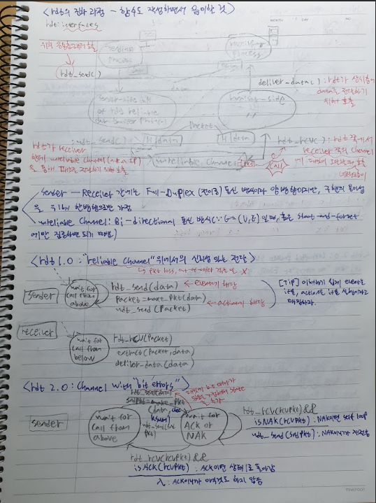
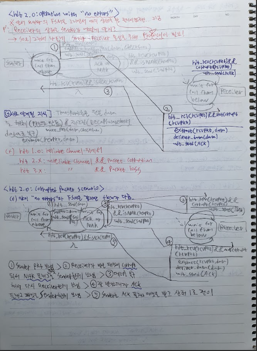
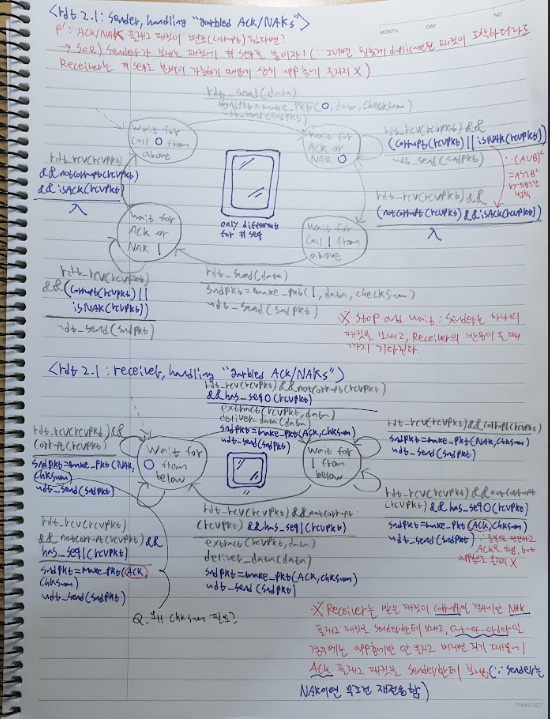
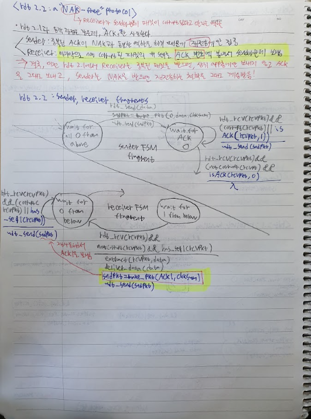

---

#### 🏗️ [Stage 2]: 분실과의 전쟁 (rdt 3.0)

##### ⚡ 사고의 균열 & 교정 (Reflection)

- **균열:** "ACK가 깨지면 바로 재송신해야 효율적이지 않나?"
- **교정:** "아니다. 타이머가 돌고 있다면 잘못된 응답은 무시($\Lambda$)하고 끝까지 기다리는 것이 중복 전송 폭발을 막는 더 견고한(Robust) 설계다. 시간이라는 자원을 관리하는 것이 핵심이다."

##### 💎 사고의 진화 (Evolution)

- **[rdt 3.0]**: "신뢰성이란 '침묵(Loss)'에 대처하는 능력이다. 타이머는 네트워크의 불확실성을 '합리적 대기'로 치환하는 장치다. 다만, 한 번에 하나만 보내고 기다리는 **Stop-and-Wait** 구조는 물리적 한계가 명확함을 직시함."

##### 🖼️ 사고의 시각화 (Active Tracing Archive)

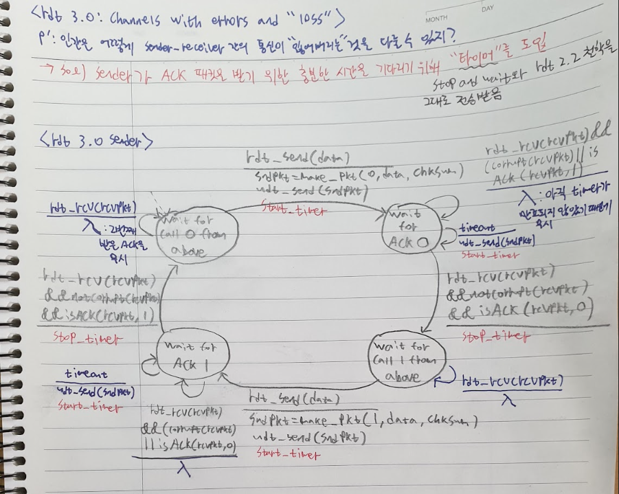
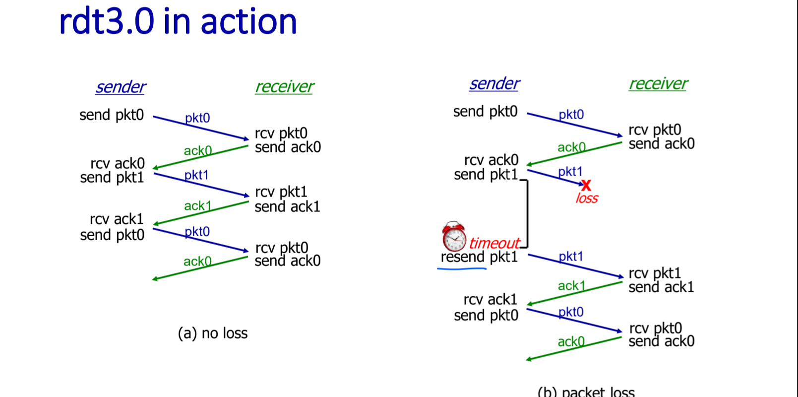
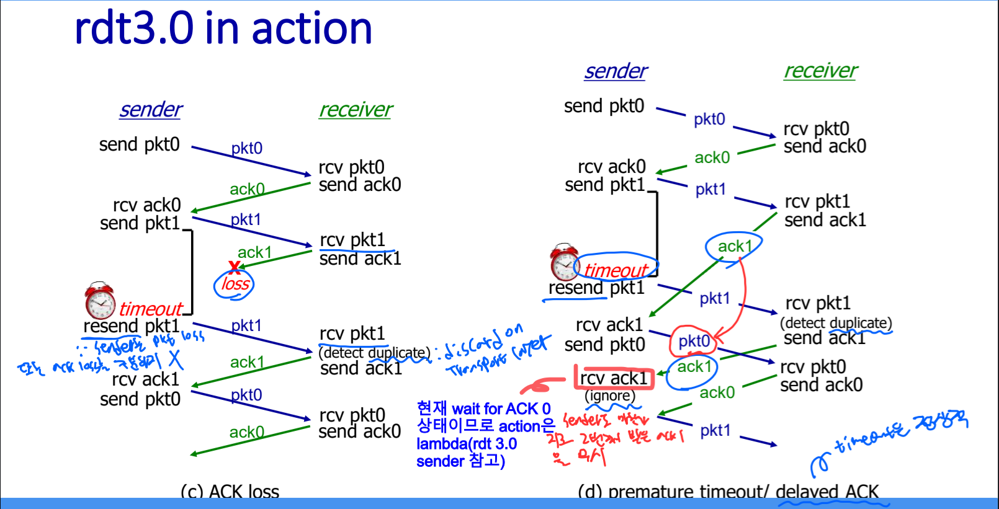

---

#### 🏗️ [Stage 3]: 성능의 한계와 돌파 ($U_{sender}$ & Pipelining)

##### 🛠️ $U_{sender}$ 수학적 격파 (Utilization Calculation)

- **상황 설정:**
  - 전송 속도 ($R$): 1 Gbps
  - 전송 지연 ($d_{prop}$): 15 ms
  - 패킷 크기 ($L$): 8000 bits
- **공식:**
  $$d_{trans} = \frac{L}{R} = 8 \mu s$$
  $$U_{sender} = \frac{d_{trans}}{RTT + d_{trans}} = \frac{0.008}{30.008} \approx 0.00027$$
- **결론:** "1Gbps 대역폭 중 고작 **0.027%**만 사용 중. 페라리를 사고 시속 1km로 달리는 꼴이다. 성벽을 신뢰 있게 쌓는 데 너무 집중한 나머지 물류 속도를 놓쳤다."

##### 🚀 기동전의 시작: Pipelined Protocols (Next Goal)

- **해법:** "Timer(Reasonable wait time)는 건드리지 않는다. 대신 송신자 측에서 Utilization을 극대화하기 위해, ACK가 오기 전까지 송신자와 수신자 간의 **컨텍스트 윈도우(Context Window)** 극한까지 패킷을 최대한 많이 쏟아붓는다."
- **공학적 통찰:** "신뢰성(rdt 3.0)을 유지하면서도 속도를 올리는 유일한 길은 '대기 시간'을 '전송 시간'으로 채우는 파이프라이닝뿐이다."
- **새로운 복선(Foreshadowing):** "이러면 송신자와 수신자 간의 윈도우 크기를 서로 합의하고 알기 위한 **'어떠한 장치'**가 반드시 필요하겠네?" ➡️ 이는 훗날 TCP의 **흐름 제어(Flow Control)**와 **혼잡 제어(Congestion Control)**라는 거대한 맥락으로 이어진다.

- **전술적 타격 지점:**
  - **Go-Back-N (GBN):** "한 놈이라도 문제 생기면 그 뒤로 다 다시 보낸다. 단순하지만 무식한 연대책임. 송신자가 타이머 하나로 관리."
  - **Selective Repeat (SR):** "문제 생긴 놈만 핀포인트로 다시 보낸다. 영리하지만 수신자의 버퍼 관리가 복잡해지는 트레이드오프. 패킷마다 타이머 필요."

---

## 🏆 오늘의 전승 요약 (Summary of Conquest)

- **수확:** rdt 1.0부터 3.0까지, 신뢰성을 위해 '번호표(Seq)', '신분증(Checksum)', '스톱워치(Timer)'를 하나씩 추가해가는 필연적 진화를 마스터함.
- **통찰:** rdt 3.0의 성능 한계($U_{sender}$)를 직시하고, 이를 타개하기 위한 **'윈도우 기반 파이프라이닝'**의 필연성을 공학적으로 도출함.
- **준비:** 이제 개별 패킷의 신뢰를 넘어, **'윈도우라는 성벽'** 안에서 시퀀스 번호와 버퍼를 어떻게 관리할 것인가(GBN/SR)를 격파할 준비가 됨.

---
