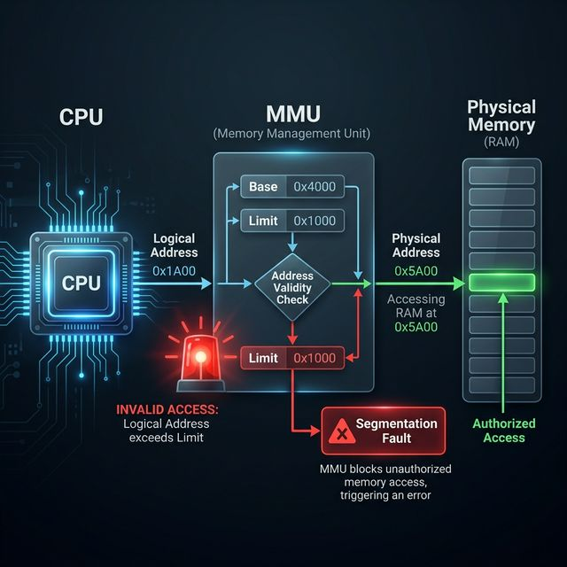
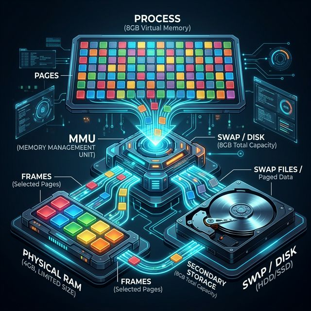
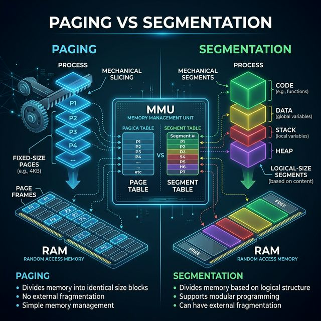
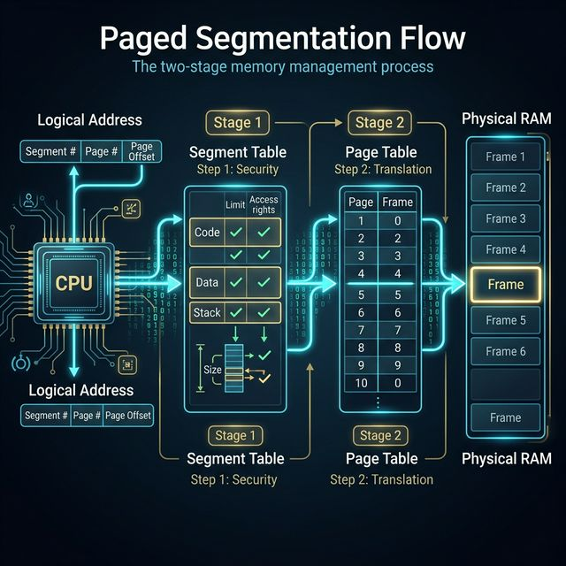
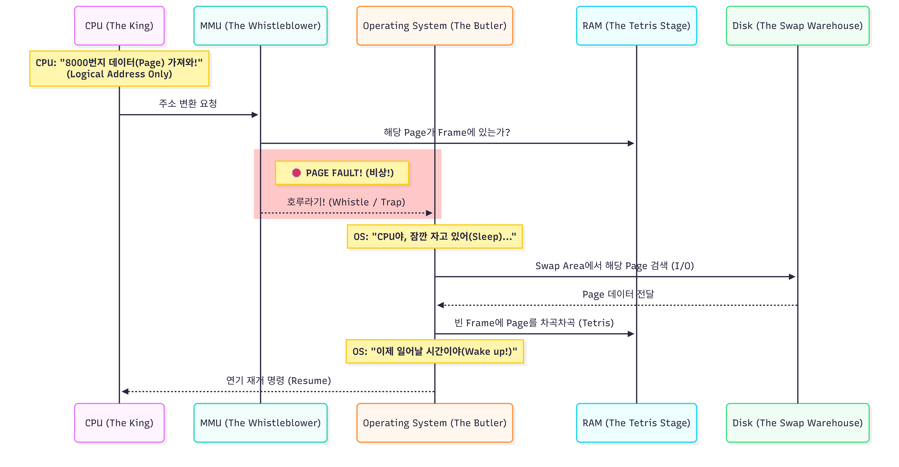

# 🧠 사고의 단련장 (Thought Workshop) - Virtual Memory

이곳은 가상 메모리의 정수를 파고드는 주군만의 사령부입니다.

---

## 📈 사고 진화 기록 (Evolution Log)

### 퀘스트 01: 메인 메모리와 가상 메모리 - "보이는 것이 전부가 아니다"

#### 🛡️ 1단계: 초기 인식 (Intuition)

- **메인 메모리(Main Memory):** CPU가 직접 주소를 지정하여 접근할 수 있는 유일한 대량 저장 장치. 물리적(Physical) RAM을 의미함.
- **논리의 도약:** "물리 메모리에는 프로세스의 실제 주소가 올라가는 게 아니라, 가상(Virtual/Logical) 주소가 먼저 올라간다."
  - 주군께서 간파하신 대로, CPU는 실제 물리 주소를 알 필요가 없음. 오직 논리 주소만 휘둘러도 MMU라는 간수가 이를 물리 주소로 번역해줌.

#### 🏗️ 2단계: 논리 조립 (Architecture)

##### 🛠️ MMU (Memory Management Unit) - "교도소 간수(Hardware)"

1.  **역할:** 논리 주소(Logical Address) → 물리 주소(Physical Address) 매핑.
2.  **메모리 보호 (Memory Protection):**
    - **Base Register:** 프로세스가 시작되는 물리 주소의 하한선.
    - **Limit Register:** 프로세스가 점유할 수 있는 메모리의 크기.
    - **Logic:** CPU가 요청한 논리 주소가 `Limit` 범위 내에 있는지 체크함. 만약 범위를 벗어나면 MMU가 즉시 **Trap**을 발생시키고 운영체제에 전권을 넘김.
3.  **Segmentation Fault:** 이 Trap의 결과물로, OS는 "너 선 넘었어!"라고 선언하며 프로세스를 강제 종료함.

##### 📂 PCB와 MMU의 협공 (Coordination)

- **PCB (신분증):** 각 프로세스의 `Base`와 `Limit` 값을 고히 간직하고 있음.
- **Context Switch:** CPU가 프로세스를 바꿀 때, OS는 PCB에 저장된 새 프로세스의 `Base`, `Limit` 값을 MMU의 레지스터에 재장전(Reload)함.
- **결과:** MMU는 이제 새로운 기준(Base/Limit)으로 메모리 영역을 철저히 감시함.

---

## 🖼️ 사고의 시각화 (Military Analogy Diagram)

##### 🛠️ Deep-Dive: MMU와 메모리 보호 (MMU & Memory Protection)

> **"프로세스가 자기 영역을 넘어서면 어떻게 되나요?"** 에 대한 시니어의 답변

1.  **CPU의 논리 주소(Logical Address):** CPU는 물리 주소를 모른 채, 0번지부터 시작되는 논리적 주소 공간에서 신나게 달립니다.
2.  **MMU의 감시 로직 (Checking Limit):**
    - **Limit Register:** 프로세스에게 허용된 '최대 영역(크기)'입니다.
    - **Base Register:** 프로세스가 시작되는 '물리 주소의 기점'입니다.
3.  **검증 과정:**
    - CPU가 보내온 논리 주소가 `Limit`보다 큰가?
    - **YES:** 즉시 **Trap** 발동! OS에게 전권을 넘기며 **Segmentation Fault**를 발생시켜 프로세스를 강제 진압(종료)합니다.
    - **NO:** 통과! `Base + Logical Address`를 계산하여 실제 물리 주소를 찾아냅니다.

> **Insight:** 이러한 하드웨어적(MMU) 보호 장치가 없다면, 하나의 프로세스가 실수(버그)로 다른 프로세스의 메모리를 오염시킬 수 있고, 이는 시스템 전체의 붕괴로 이어집니다.

##### 🛠️ Deep-Dive: 물리 메모리 한계 극복 (Overcoming RAM Limits)

> **"어떻게 4GB RAM에서 8GB 프로세스를 돌릴 수 있나요?"** 에 대한 시니어의 답변

1.  **가상 메모리(Virtual Memory):** 사용자(프로세스)에게 "너는 8GB의 광활한 영지를 가졌다"고 속이는 가짜 주소 공간입니다.
2.  **페이징(Paging):** 8GB 프로세스를 아주 작은 '쪽지(Page)' 단위로 쪼겹니다.
3.  **요구 페이징(Demand Paging):** 8GB를 한꺼번에 RAM에 올리지 않습니다. 지금 당장 CPU가 읽어야 할 '200MB' 정도의 페이지만 골라서 실제 RAM(물리 메모리)에 꽂아줍니다.
4.  **스왑 영역(Swap Area):** 나머지 당장 안 쓰는 정보들은 디스크(HDD/SSD)의 구석진 곳에 '대기' 상태로 둡니다.

> **Insight:** 이러한 **'눈속임'**의 핵심은 MMU가 논리 주소를 물리 주소로 실시간 매핑해주기 때문에 가능합니다. 만약 RAM에 없는 페이지를 CPU가 요청하면 **Page Fault**가 발생하여 디스크에서 가져오게 됩니다.

##### 🛡️ 시니어의 핵심 교정: 캐시 미스(Cache Miss) vs 페이지 부재(Page Fault)

> **"RAM에도 데이터가 없으면 결국 디스크(I/O)까지 가는 건가요?"** 에 대한 답변

1.  **계층적 탐색의 사슬:** CPU → Cache (Miss) → RAM (Fault) → Disk (Fetch).
2.  **구분의 기준 (Hardware vs OS):**
    - **Cache Miss:** 하드웨어가 자동으로 RAM에서 데이터를 가져옵니다. (매우 빠름)
    - **Page Fault:** 하드웨어(MMU)가 "없어!"라고 알리면, **운영체제(OS)**가 개입하여 디스크 I/O를 수행합니다. (매우 느림)
3.  **철학적 결론:** OS가 페이지 교체 알고리즘(LRU 등)에 집착하는 이유는, 단 한 번의 Page Fault가 수천 번의 캐시 미스보다 시스템 성능에 치명적이기 때문입니다.

##### 🎯 가상 메모리의 마법사: 지역성 (Locality of Reference)

> **"왜 굳이 '가상' 메모리라는 복잡한 일을 벌여도 시스템이 잘 돌아가나요?"** 에 대한 시니어의 답변

1.  **지역성(Locality):** 프로그램은 모든 메모리를 골고루 쓰지 않습니다. 특정 시점에는 특정 부분만 후벼팝니다.
    - **시간 지역성 (Temporal Locality):** "방금 쓴 놈이 또 불려간다." (for문의 변수 `i` 등)
    - **공간 지역성 (Spatial Locality):** "방금 쓴 놈 옆집이 불려간다." (배열의 순차 접근 등)
2.  **캐싱 라인 (Cache Line):** 캐시는 데이터를 하나씩 가져오는 것이 아니라, **'동네(Line)'** 단위로 묶어서 가져옵니다. 주군께서 말씀하신 **Byte-addressable**한 메모리 덩어리를 통째로 캐시 태그와 함께 저장하여, 탐색 시간을 $O(1)$에 가깝게 줄이는 병기입니다.
3.  **결론:** 이 지역성 덕분에 우리는 전체 프로세스 중 **5~10%의 활발한 데이터(Working Set)**만 RAM에 올려두고도, 사운드 카드부터 그래픽 카드까지 모든 공연(I/O)을 완벽하게 소화할 수 있습니다.

##### 🌐 실전 영지 확장: 클라우드(AWS)와 게임 엔진 속의 가상 메모리

> **"실제 실무나 게임에서는 이 가상 메모리 논리가 어떻게 쓰이나요?"** 에 대한 시니어의 답변

1.  **AWS EC2 Swap (클라우드의 생존 전략):**
    - **상황:** 프리티어(t3.micro)처럼 RAM이 1GB인 한계 상황.
    - **전략:** **OOM Killer**가 프로세스를 죽이기 전에, SSD(EBS)에 **Swap File**을 만들어 가상 메모리를 강제로 확장합니다. \"느려지더라도 죽지는 말자\"는 배수의 진입니다.

2.  **게임 로딩창 & 스트리밍 (I/O 병목의 은폐):**
    - **로딩창 (Pre-fetching):** 유저가 지루해하기 전에 디스크의 데이터를 RAM으로 미리 다 끌어올려, 실제 플레이 중 **Page Fault(Stuttering)**가 발생하는 것을 원천 봉쇄합니다.
    - **심리스 스트리밍:** 오픈월드 게임에서 유저 이동 방향의 데이터를 백그라운드에서 조용히 가져옵니다. 이때 예측보다 빠르게 이동하여 'Pop-in' 현상이나 프리징이 생긴다면, 그것이 바로 **I/O 병목이 유저에게 들킨 순간**입니다.

---

## 🖼️ 사고의 시각화 (Memory & Storage Hierarchy)

> **"디스크, 파일 시스템, 스왑, 그리고 메모리의 관계를 한눈에!"** 에 대한 시니어의 브리핑

1.  **물리 디스크 (Physical Disk - 하드웨어 최하단):**
    - **본질:** 차가운 금속과 자석의 세계. 전원이 꺼져도 데이터가 살아남는 영구 저장소입니다. 하지만 CPU가 직접 대화하기엔 너무 느립니다.
2.  **파일 시스템 (Logical File System - 디스크 위의 안경):**
    - **역할:** "무질서한 데이터 블록"에 **이름(File Name)**과 **권한(Permission, chmod)**을 부여하는 논리적 계층입니다.
    - **핵심:** 여기서 실행 파일(.exe)이 선택되어 '프로세스'라는 이름으로 RAM으로 도약합니다.
3.  **물리 메모리 (RAM - 활기찬 무대):**
    - **역할:** 프로세스가 실제로 빛을 발하며 실행되는 **'공동 작업장'**입니다. 4KB 단위의 페이지들로 가득 차 있으며, 매우 빠르지만 전원을 끄면 사라집니다.
4.  **스왑 브릿지 (Swap Bridge - 생명의 다리):**
    - **임무:** 무대(RAM)가 꽉 찼을 때, 당장 연기하지 않는 조연 배우(Page)들을 잠시 지하 대기실(Disk의 Swap 영역)로 보내주는 통로입니다.
    - **트레이드오프:** 이 다리를 오가는 순간 시스템이 느려지지만, 공연(프로세스)이 중단되는 최악의 사태(OOM)는 막아줍니다.

---

##### 🛠️ Deep-Dive: 페이징 vs 세그먼테이션 (Paging vs Segmentation)

> **"프로세스를 어떻게 조각내나요? 의미가 있나요?"** 에 대한 시니어의 답변

1.  **페이징 (Paging): "기계적 깍둑썰기" (Fixed-size)**
    - **철학:** 의미 따위 상관없다. 무조건 **4KB**로 일정하게 자른다.
    - **장점:** 물리 메모리 구멍(외부 단편화)이 생기지 않아 효율적입니다.
    - **단점:** 프로세스의 논리적 구조(Code/Data/Stack)가 무시되어 보호나 공유가 복잡합니다.

2.  **세그먼테이션 (Segmentation): "논리적 덩어리" (Logical-size)**
    - **철학:** 의미 중심! **Code 덩어리, Data 덩어리, Stack 덩어리**로 나눈다.
    - **장점:** 사용자가 생각하는 방식과 일치하며, 영역별 보호(Read/Write 권한 설정)가 쉽습니다.
    - **단점:** 덩어리 크기가 제각각이라 물리 메모리에 딱 맞는 빈자리를 찾기 어렵습니다(**외부 단편화**).

> **Insight:** 주군께서 간파하신 **Segmentation Fault**는 바로 이 '세그먼트(논리 주소 범위)'를 벗어난 곳을 찌르려고 할 때 MMU가 호루라기를 부는 것입니다. 현대 OS는 이 두 방식의 장점만 섞은 **[Paged Segmentation]** 기법을 주로 사용합니다.

##### 🛠️ Deep-Dive: MMU의 신비로운 2중 지도 (Paged Segmentation Flow)

> **"CPU의 논리 주소가 어떻게 실제 물리 데이터가 되나요?"** 에 대한 시니어의 답변

1.  **1단계: 의미 보안 (Segment Table Check)**
    - **CPU:** "코드 영역의 100번지 데이터 줘!"
    - **MMU:** 세그먼트 테이블을 봅니다. "음, 100번지는 코드 영역(`Limit` 이내)이군. 접근 권한 확인 완료!"
    - **결과:** 경계 침범 시 여기서 **Segmentation Fault**가 발생합니다.

2.  **2단계: 물리 번역 (Page Table Translation)**
    - **MMU:** "그럼 이 코드 세그먼트의 '페이지 테이블'을 열자. 100번지는 3번 페이지이군. 오! 3번 페이지는 물리 RAM의 **7000번 칸(Frame)**에 꽂혀 있네!"
    - **결과:** 실제 데이터의 물리적 위치를 정확히 낚아챕니다.

3.  **3단계: 최종 접근 (Final CPU Access)**
    - 물리 RAM 7000번지에서 명령어를 가져와 CPU에게 던져줍니다. (CPU Burst!)

> **Insight:** 주군께서 간파하신 **해시 테이블(Hash Table)**의 비유처럼, OS는 의미(Segment)와 물리(Page)라는 두 개의 인덱스를 결합하여 보안과 효율을 동시에 달성합니다.

##### 🛡️ 시니어의 핵심 교정: 일관성의 미학 (Unified Paging Policy)

> **"프로세스가 RAM보다 작으면 페이징을 안 해도 되지 않나요?"** 에 대한 답변

- **현대 OS의 선택:** 프로세스의 크기가 RAM보다 크든 작든, **무조건 4KB 단위로 기계적으로 자릅니다.**
- **이유:** 관리의 **'일관성(Consistency)'** 때문입니다.
  1. 예외 케이스를 두면 OS의 주소 변환 로직이 복잡해져 오히려 성능이 떨어집니다.
  2. **외부 단편화(External Fragmentation)**를 원천 봉쇄하여, 메모리 중간중간에 생기는 '어중간한 빈 공간' 낭비를 막기 위함입니다.
- **결론:** 주군의 프로세스가 아무리 작아도, OS는 자비 없이 **4KB 조각들(Pages)**로 분해하여 빈칸에 쑤셔 넣습니다. 이것이 현대 메모리 관리의 철칙입니다.

---

## 📅 다음 수련 예고 (Coming Soon)

1.  **페이지 교체 알고리즘 (Page Replacement):** 꽉 찬 RAM에서 누구를 내보낼 것인가 (FIFO, LRU, LFU).
2.  **TLB:** 이 거대한 테이블 탐색 속도를 빛의 속도로 줄여주는 주소 변환 캐시병기.
3.  **쓰레싱 (Thrashing):** 페이지 부재가 너무 빈번해져 시스템이 '멈춤' 상태가 되는 재앙.

---

## 🖼️ 사고의 시각화 (The King & Tetris Analogy) 🏰🟦

> **[2026-04-17] 주군의 직관적 통찰: "분수 넘치는 프로세스와 테트리스 조각들"**

### 🎙️ 3단계: 실전 발화 (Verbatim Execution) ⚔️

- **[2026-04-17 주군 발화]**: "CPU는 오로지 프로세스의 논리 주소만 알기 때문에 원하는 주소 마음대로 갖다 씀. 그런데 RAM 위에 올려져 있는 프로세스는 자신의 몸집의 2배인 8GB임. 현대 OS는 일관성과 외부 단편화를 방지하기 위해 4KB 크기로 page를 깍둑썰기함. CPU가 요청할 때마다 page를 RAM의 프레임에 테트리스 쌓기하듯 차곡차곡 쌓아놓음. 그런데, CPU는 디스크보다 물리 메모리와 매우 가까이 있기 때문에 얘한테만 접근을 하는데, CPU가 원하는 페이지가 RAM에 없어! 비상!(∵나머지는 저 멀리 디스크 창고의 Swap Area에 처박아 둡니다.) MMU는 즉시 호루라기를 불어서 OS한테 알림(왜? MMU는 page table을 알고 있으니까) -> OS는 CPU한테 자라고 최면을 걸고 디스크에 접근해서 I/O 작업으로 swap area에 있는 페이지를 가져오고 프레임에 넣음 -> OS는 CPU를 wake하고 다시 너 하던거 하라고 함."

---

### ⚡ 4단계: 부관의 피드백 & 심화 (Deep-Dive)

- **[S-Rank 분석]**:
  - **통찰:** 페이징의 목적(일관성/단편화 방지)과 **테트리스(Tetris)** 비유를 통해 '불연속적 메모리 할당'의 본질을 완벽히 꿰뚫으셨습니다.
  - **비유:** **'자라고 최면을 건다(Wait/Sleep)'**와 **'다시 너 하던 거 하라고 함(PC 복구/Resume)'**이라는 표현은 프로세스의 상태 전이(State Transition)와 컨텍스트 스위칭의 오버헤드를 정확히 이해하고 계심을 증명합니다.
  - **핵심 키워드 매칭:**
    - **테트리스 쌓기**: `Paging` & `Non-contiguous allocation`
    - **호루라기**: `Hardware Trap` / `Page Fault`
    - **창고(Swap Area)**: `Backing Store`

---

## 🏆 사고의 임계점 (Thresholds)

- **[2026-04-17]**: "가상 메모리는 **'CPU라는 제왕의 오만함'**을 지탱하기 위해 **'OS라는 집사가 수행하는 눈물겨운 테트리스'**다." (주군과 부관의 논리 통합)
