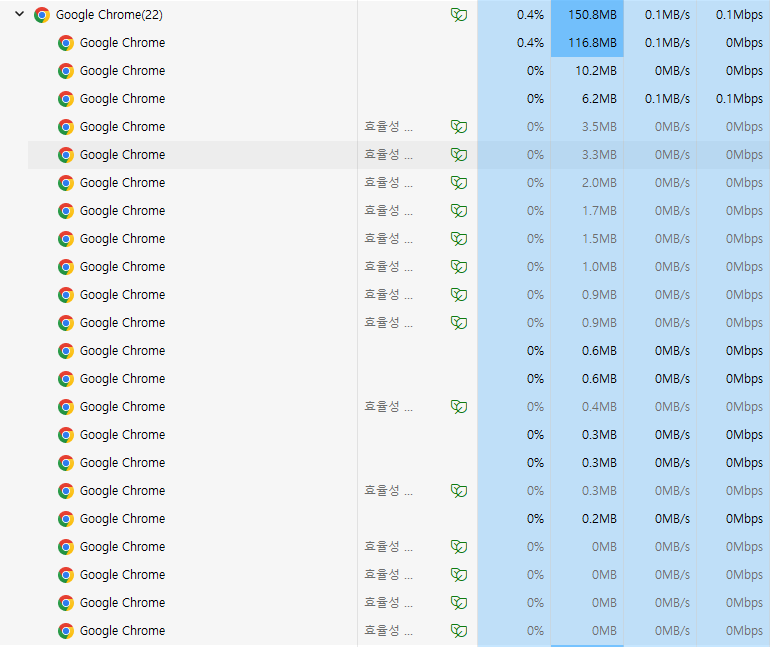
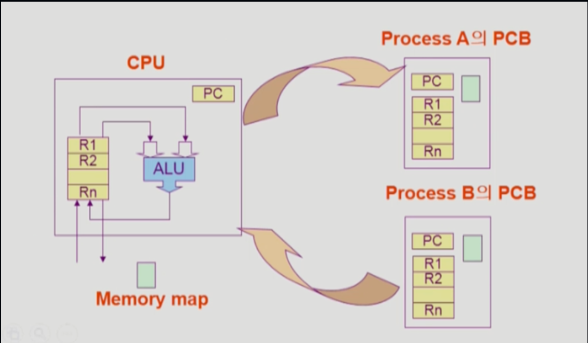

# 🧠 사고의 단련장 (Thought Workshop) - Operating System

## 📈 사고 진화 기록 (Evolution Log)

### 퀘스트 01: 프로세스 vs 스레드 - "자원 관리의 단위"

#### 🛡️ 1단계: 초기 인식 (Intuition)

- "운영체제는 자원 관리자(Resource Manager)다. 한정된 자원을 어떻게 나눠주느냐가 관건."
- "프로세스는 독립된 집, 스레드는 그 안의 일꾼들."

#### 🏗️ 2단계: 논리 조립 (Architecture)

- **크롬 브라우저의 멀티프로세스 전략:**
  - 탭 하나가 죽어도 전체가 살아야 함 (Crash Resilience).
  - 이를 위해 탭마다 독립된 메모리(RAM)를 할당하는 '멀티프로세스' 방식을 채택 (RAM 소모 ↔ 안정성 교환).
- **HOL Blocking과 병렬성 (Network + OS + Infra):**
  - **문제:** HTTP/1.1에서의 선두 패킷 지연(Head-of-Line Blocking).
  - **해법 1 (OS + HW):** 멀티 스레드와 다중 코어를 통한 물리적 병렬 처리.
  - **해법 2 (Infra):** 도메인 샤딩(Domain Sharding)을 통해 여러 개의 TCP 연결을 생성하여 우회.
  - **해법 3 (Protocol):** HTTP/2의 멀티플렉싱(Interleaving)으로 프로토콜 단에서 해결.

#### 🎙️ 3단계: 실전 발화 (Verbatim Execution) - _대기 중_

- "여기에 주군의 생생한 답변이 기록될 예정입니다."

---

## 🖼️ 사고의 시각화 (Military Analogy Diagram)

##### 🛠️ Deep-Dive: 실무적 이해 (Chrome & Multi-Process/Thread)

> **"작업 관리자의 크롬 아코디언은 무엇을 의미하나요?"** 에 대한 시판 해답

1.  **브라우저 탭 = 자식 프로세스:** `fork()`를 통해 생성된 독립적 실행 단위. Sandbox 격리를 통해 보안과 안정성을 확보함.
2.  **렌더링 로직 = 멀티 스레드:** 하나의 탭(프로세스) 안에서 JS 실행, 이미지 렌더링, 네트워크 통신 등이 **Heap/Data 영역을 공유**하며 병렬적으로 작동.

##### 🛡️ 하드웨어와 OS의 협공: 병렬성(Parallelism)과 격리(Isolation)

> **"프로세서는 무엇이며, 어떻게 서로 침범하지 않게 관리하나요?"** 에 대한 시니어의 답변

1.  **프로세서 (Processor) vs 멀티프로세서 (Multi-Processor):**
    - **프로세서:** 연산과 제어를 담당하는 하드웨어인 **CPU** 그 자체.
    - **멀티프로세서:** 현대에는 주로 **멀티 코어(Multi-core)** 환경을 의미. 물리적 일꾼(코어)이 여러 명이라서 **'진동시(Parallelism)'**에 각기 다른 프로세스/스레드를 병렬 처리 가능.
2.  **격리의 주체: PCB와 MMU (The Guard Logic):**
    - **PCB (Process Control Block):** OS가 프로세스를 관리하기 위한 **'신분증 & 기록부'**. 각 프로세스의 ID, 상태, 메모리 한계(Base/Limit) 정보가 담김.
    - **MMU (Memory Management Unit):** CPU 내부에 위치하여 실제로 선을 넘는지 감시하는 **'교도소 간수(Hardware)'**.
    - **Logic:** 프로세스가 메모리 요청 시, MMU가 **PCB에 적힌 허용 범위**를 체크하여 침범 시 즉시 **Segmentation Fault**를 발생시켜 시스템을 보호함.

> **Insight:** 네트워크의 한계(HOL Blocking)를 극복하기 위해 단순히 소프트웨어적 **멀티 스레드**에만 의존하지 않고, **도메인 샤딩**이라는 인프라 설계와 **멀티프로세스**라는 OS 설계를 결합하는 것이 진정한 엔지니어링의 묘미임.

##### ⚡ Context Switching: '이사(Process)' vs '교대(Thread)'의 진실

> **"왜 프로세스 스위칭은 무겁고, 스레드 스위칭은 가벼운가요?"** 에 대한 하드웨어적 답변

1.  **프로세스 스위칭 (The Heavy Move):**
    - CPU가 A 프로세스에서 B로 넘어갈 때, **L1 Cache** 등에 쌓인 모든 컨텍스트와 데이터가 **Flush(비워짐)**되어야 합니다. 완전히 새로운 주소 공간으로 **실행 맥락(Context)**을 옮기는 '이사'와 같아 오버헤드가 막대합니다.
2.  **스레드 스위칭 (The Light Shift):**
    - 같은 프로세스 내에서 일꾼(스레드)만 바뀝니다. **Code, Data, Heap** 영역을 공유하므로, 캐시를 싹 비울 필요 없이 자신의 작업 수첩(**Stack**)만 들고 교대하면 됩니다. '교대 근무'처럼 신속하고 가볍습니다.

> **Insight:** 사이버라인 솔루션의 고성능 처리를 위해서는 효율적인 **스레드 풀(Thread Pool)** 관리가 필수적이며, 이는 곧 하드웨어의 **캐시 히트율(Cache Hit Rate)**과 직결되는 공학적 결정임을 인지하고 있습니다.

---

#### 🎙️ 3단계: 실전 발화 (Verbatim Execution) �️ Rank S

> **[2026-04-03 실전 발화 요약]**: "안정성을 위해 멀티프로세스의 '격리성'을 택하되, 그에 따른 '캐시 플러시(L1 Cache Flush)'와 'PCB 교체'의 오버헤드를 인지하고 이를 스레드 풀링 등으로 최적화하는 통찰력을 증명함."

- **[2026-04-03]**: "운영체제를 배우는 이유는 결국 **'자원을 어떻게 효율적으로 관리하는가'**에 대한 해답을 찾기 위해서다." (용사의 직관)
