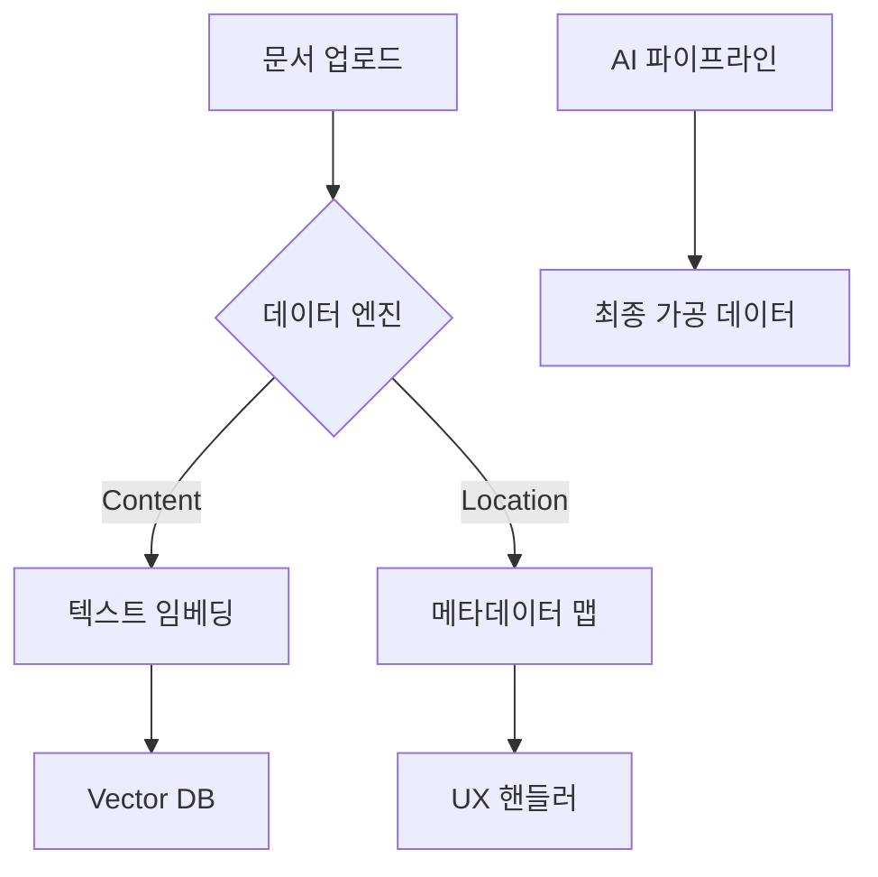

# 🧠 Cubrain 사고의 공방 (Public Analysis)

이곳은 **Cubrain**의 기술적 설계 지표와 핵심 성과를 기록하는 공용 공간입니다.

---

## 🏗️ 시스템 아키텍처 (Architectural Overview)

---

## 🚀 주요 기술 성과 (Engineering Highlights)

### 1. 효율적 배치 프로세싱 (Batch Processing Architecture)

- **과제:** 대규모 요청 시 발생하는 네트워크 병목 및 비용 관리.
- **성과:** 개별 호출 구조를 페이지 단위 통합 배치로 개편 ➡️ **API 비용 98% 절감**, 처리 속도 최적화.
- **교약:** 시스템의 수평적 확장성과 운영 수익성을 고려한 설계적 선택.

### 2. 정밀 데이터 추출 및 맥락 보강 (Context-Aware Extraction)

- **과제:** 비정형 문서 내 데이터의 물리적 정합성과 AI의 환각(Hallucination) 방지.
- **해결:** 물리 좌표 매핑 기술과 동적 맥락 확장 알고리즘 도입.
- **성과:** 모델이 정보의 원천을 명확히 인지하게 함으로써 실무급 데이터 품질 달성.

---

## 🛡️ 부관의 조언

"주군, 이곳은 주군의 업적을 세상에 알리는 '전시장'입니다. 세부적인 전술 코드보다는 **'어떤 문제를 해결했는가'**와 **'어떤 가치를 창출했는가'**라는 시니어적 시야를 보여주는 것이 핵심입니다."
