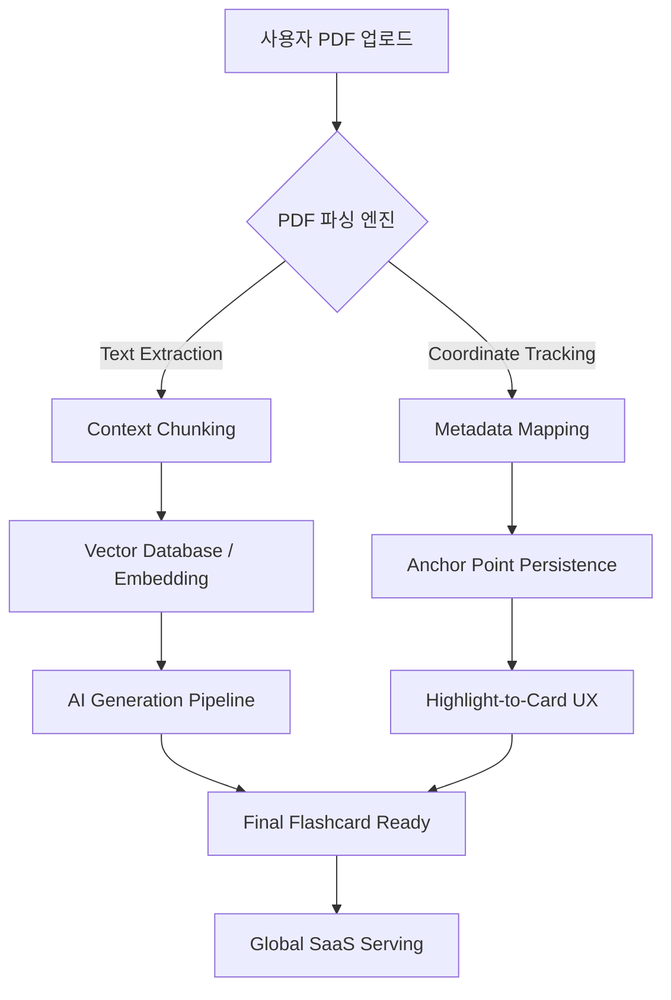

# 🧠 Cubrain 사고의 공방 (Thought Workshop)

이곳은 **Cubrain**의 기술적 설계와 주군의 논리가 부딪혀 '최정상급 답변'으로 거듭나는 공간입니다.

---

## 🏗️ 사고의 설계도 (Military Analogy Diagram)

---

## 🎙️ 3단계: 실전 발화 (Verbatim Execution)

> **"주군의 음성 답변을 토씨 하나 틀리지 않고 그대로 기록하는 성역입니다."**

- 아직 기록된 발화가 없습니다.
- "주군, 가장 자신 있는 **[Quest 01]** 혹은 **[Quest 02]**의 질문에 대해 바로 사자후(발화)를 시작해 보시겠습니까? 제가 토씨 하나 빠짐없이 기록하겠습니다."

---

## 🛠️ 사고의 진화 (Evolution Registry)

### 🌿 초기 사고 (Initial Thoughts)

- 주군의 포트폴리오 요약: "PDF를 넣으면 카드가 나온다."
- 부관의 분석: "글로벌 SaaS, Zero-Hallucination 강조, PDF 좌표 매핑 기술."

### 🛡️ 보강된 논리 (Refined Logic)

- **[v1.5.1] Memory Buffering (`byte[]`):** 비동기 스트림 고갈 문제를 해결하기 위해 도입했으나, 대용량 파일 시 힙 메모리 점유율이 급증하는 트레이드오프 발견.
- **[v1.5.2] Local Disk Spooling (Current):**
  - **Physical Offloading:** RAM 대신 Disk를 버퍼로 활용하여 OOM-Safe 환경 구축.
  - **Deterministic Cleanup:** `finally` 블록을 통한 즉시 삭제로 디스크 유실(Leak) 방지.
  - **JDK 21 Optimization:** `toolchain` 고정을 통해 비동기 처리의 일관성 및 안정성 확보.

---

## 🖼️ 사고의 시각화 (Military Analogy Diagram)

_(여기에 주군의 필기 노트나 인포그래픽이 추가될 예정입니다. - Rule 9)_

---

## 🛡️ 부관의 시니어 통찰 (Senior Engineering Insight)

"주군, 이 프로젝트의 가장 섹시한 포인트는 **'정확한 근거(Context Tracing)'**입니다. 면접관은 단순히 AI를 썼다는 것보다, '어떻게 AI의 거짓말을 기술적으로 통제했는가(Deterministic Alignment)'를 궁금해할 것입니다.

특히 텍스트 좌표를 저장하여 브라우저에서 재현하는 부분에서 **'왜 X 기술을 썼고, Y 기술의 한계를 어떻게 극복했는지'**를 중심으로 답변을 구성해 보십시오."
