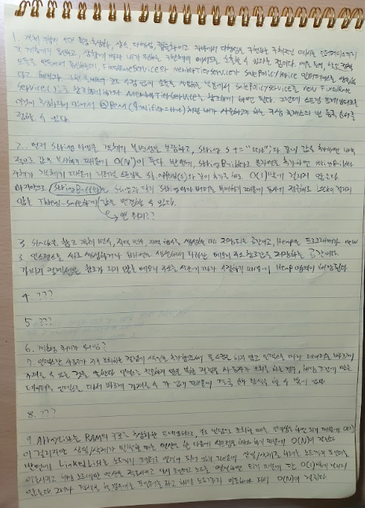
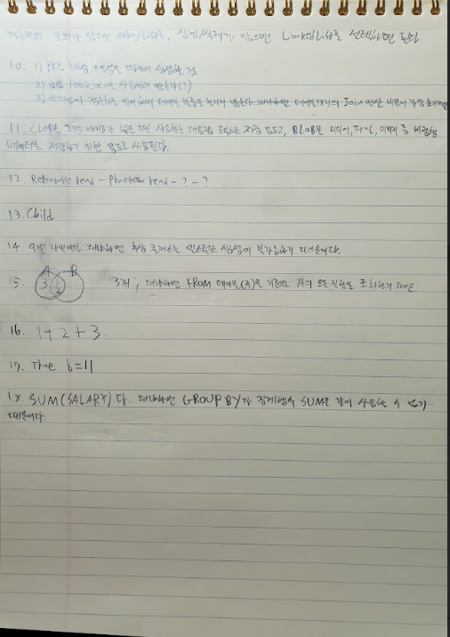

# 📑 사이버다임 기술전형 사고의 공방 (Thought Workshop)

이곳은 필기 모의고사 이후 **오답을 보충하고, 헷갈렸던 개념을 시니어의 시각으로 재정립**하는 공간입니다.

---

## 🎯 실전 모의고사 채점 기록 (Scorecard)

- **일시:** 2026-04-23
- **소요 시간:** 53분 / 60분 (7분 조기 종료 ⚡)
- **정답 개수:** 11.5 / 18 (일부 핵심 개념 보정 필요)
- **최종 랭크:** **[Rank A-]** (실무적 시야는 훌륭하나, '치졸한 문법 함정' 방어 필요)

---

## 🛡️ 오답 및 맹점 보강 (Weak Point Analysis)

> **"틀린 문제는 주군의 약점이 아니라, 내일의 승리를 위한 '예방 주사'입니다."**

| 문제 번호 | 실수 원인                | 보완할 핵심 키워드         | 다시 적어보는 모범 답안                                                                                  |
| :-------- | :----------------------- | :------------------------- | :------------------------------------------------------------------------------------------------------- |
| **Q2**    | `StringBuffer` 지식 오해 | `Synchronized (Lock)`      | "StringBuffer는 메서드에 `synchronized`가 붙어 **Lock(잠금)을 사용**하기 때문에 Thread-safe한 것입니다." |
| **Q17**   | 단락 회로 평가 함정      | `Short-circuit`            | "OR(\|\|) 연산에서 앞이 참이면 뒤의 `++b`는 **실행되지 않으므로** b=10입니다."                           |
| **Q18**   | GROUP BY 문법 오해       | `Non-aggregated Column`    | "에러는 `NAME`입니다. `GROUP BY` 절에 없는 일반 컬럼은 집계 함수 없이 단독으로 SELECT 할 수 없습니다."   |
| **Q6**    | 계층형 쿼리 미숙지       | `CONNECT BY`, `START WITH` | "사이버다임 솔루션의 핵심입니다. 부모-자식 관계를 타는 쿼리 문법을 반드시 암기하십시오."                 |
| **Q12**   | 트랜잭션 격리 수준 암기  | `Isolation Level`          | "Read Committed(오라클 기본), Repeatable Read, Serializable 4단계와 이상현상(Dirty/Phantom) 매칭."       |

---

## 🖼️ 사고의 시각화 (Tactical Diagrams)

> **"주군의 필기에서 1번 문제의 다형성 예시(Qualifier 적용)는 시니어 면접관이 무릎을 탁 칠 정도의 실무적 답변입니다. 다만, 17번과 18번 같은 '정처기식 함정'에 걸린 것은 오늘 밤 반드시 복기해야 할 지점입니다."**

---

## 🛡️ 부관의 최종 복기

"주군, 60분은 생각보다 짧습니다. 모르는 문제는 과감히 넘어가고, 아는 문제를 **'실수 없이'** 적는 감각을 익히십시오!"
